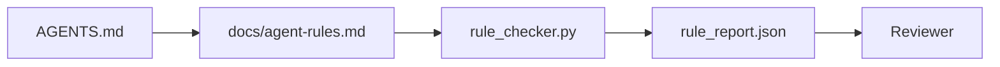

# 将 Agent 指令作为可执行约束

> 写成散文的指令只是愿望，写成约束的指令才是测试。workbench 把每条规则变成 agent 在运行时能检查、reviewer 事后能验证的东西。

**Type:** Build
**Languages:** Python (stdlib)
**Prerequisites:** Phase 14 · 32 (Minimal Workbench)
**Time:** ~50 minutes

## 学习目标

- 把路由式散文与可操作规则区分开来。
- 把启动规则、禁止动作、完成定义、不确定处理以及审批边界表达为机器可检查的 constraint。
- 实现一个 rule checker，针对 rule set 对一次 run 打分。
- 让 rule set 对 diff 友好，使 review 能看到改了什么。

## 问题

一个典型的 `AGENTS.md` 读起来像 onboarding 文档。它告诉 agent「要小心」「要彻底测试」「不确定就问」。三天后，agent 交付了一个没有测试的改动，往禁止目录里写了文件，而且从来不问——因为它从来不知道那条线在哪里。

指令在「可操作」时才有力量，在「只是愿望」时软弱无力。修复办法是写出 workbench 能解释、reviewer 能打分的规则。

## 概念

规则放在 `docs/agent-rules.md` 里，与根目录那个短小的路由文件分开。每条规则有一个名字、一个类别和一个 check。



### 覆盖大多数规则的五种类别

| 类别 | 该规则回答的问题 | 示例 |
|----------|---------------------------|---------|
| 启动 | 开始工作前什么必须为真？ | "state 文件存在且新鲜" |
| 禁止 | 什么永远不能发生？ | "不要编辑 `scripts/release.sh`" |
| 完成定义 | 什么证明任务已完成？ | "pytest 退出码为 0 且验收行通过" |
| 不确定 | 不确定时 agent 做什么？ | "打开一个问题 note 而不是猜测" |
| 审批 | 什么需要人工批准？ | "任何新依赖、任何生产写入" |

一条不在这五种里的规则通常想被拆成两条。强制拆分。

### 规则是机器可读的

每条规则有一个 slug、一个类别、一行描述，以及一个 `check` 字段，它指向 `rule_checker.py` 里的一个函数。加一条规则意味着加一个 check；checker 随 workbench 一起成长。

### 规则对 diff 友好

规则在一个 markdown 文件里每条一个标题。重命名在 diff 里可见。新规则放在其类别的顶部。过时规则被删除，而不是注释掉，因为 workbench 才是真相的源头，而不是团队上个季度感受的聊天记录。

### 规则与框架 guardrail

框架 guardrail（OpenAI Agents SDK guardrails、LangGraph interrupts）在运行时层强制执行规则。本课的 rule set 是那些 guardrail 所实现的可读、可 review 的契约。两者都需要：运行时在单个 turn 里抓住违规，rule set 证明运行时在做正确的事。

### 渐进式披露：一张地图，不是一部百科全书

`AGENTS.md` 持续膨胀的原因是：每次事故都加一条规则，但没有事故会删一条。一年后，文件有两千行，agent 读完第一屏就用尽了 attention budget，只按它被告知内容的一小部分行事。一个巨大的指令文件之所以失败，和一份四十页的 onboarding 文档失败的原因相同：读者草草读一遍，再也不会回到真正重要的那部分。

修复不是更短的文件，而是分层的文件。根路由保持小到每个 session 都能读完，只容纳指针。深度放在 topic 文件里，agent 只在任务触及它们时才加载。给 agent 一张地图，而不是整部百科全书，让它走到它需要的那一页。

```
AGENTS.md                  # 路由，< 50 行：这个 repo 是什么、去哪找、5 条硬规则
docs/
  agent-rules.md           # 完整 rule set（本课）
  architecture.md          # 当任务触及模块边界时加载
  testing.md               # 当任务编写或运行测试时加载
  deploy.md                # 仅为发布工作加载，由一条审批规则把关
feature_list.json          # backlog（Phase 14 · 36）
```

| 层级 | 存放位置 | 何时读取 | 大小预算 |
|------|----------|-----------|-------------|
| 路由 | `AGENTS.md` | 每个 session，总是 | 约 50 行以内 |
| 规则 | `docs/agent-rules.md` | 每个 session，启动时 | 每类别一屏 |
| Topic 文档 | `docs/<topic>.md` | 仅当任务触及该 topic | 视需要而定 |

两个测试让分层保持诚实。可达性测试：agent 应当从路由最多两步到达任何规则，因此路由必须按路径链接每个 topic 文档，而不是用散文描述它。新鲜度测试：路由短到 reviewer 在每次 PR 上都会重读，只有这一点能阻止它悄悄长回它取代的那部百科全书。一个无法解析的指针比缺失的规则更糟，因此路由中的断链本身就是一条启动检查违规。

```figure
wb-rule-checkoff
```

## Build It

`code/main.py` 提供：

- 一个 `agent-rules.md` 解析器，把规则加载进 dataclass。
- `rule_checker.py` 风格的 checker 函数，每个 `check` 引用一个。
- 一个故意违反两条规则的 demo agent run，以及一个能抓住它们的检查通过。

运行它：

```
python3 code/main.py
```

输出：解析后的 rule set、run trace、每条规则的 pass/fail，以及保存在脚本旁边的 `rule_report.json`。

## 生产环境中的实际模式

三种模式区分了「能撑一个季度的 rule set」和「一周就腐烂的 rule set」。

**写时打严重度标签。** 每条规则带 `severity`：`block`、`warn` 或 `info`。checker 报告全部三种；运行时只在 `block` 上拒绝。多数团队一开始高估严重度，随后在截止日期压力下悄悄调低；在写时打标签迫使一开始就校准。与 verification gate（Phase 14 · 38）配合，后者把任何对 `block` 规则的覆盖签名写入 `overrides.jsonl` 审计日志。

**规则到期作为强制函数。** 每条规则带一个 `expires_at` 日期（默认自写作起 90 天）。当一条未到期规则连续 60 天零违规时，checker 发出一则警告；下一次季度 review 要么证明保留它、要么把它降为 `info`、要么删除它。Cloudflare 的生产 AI Code Review 数据（2026 年 4 月，30 天内覆盖 5,169 个 repo 的 131,246 次 review run）显示：带显式到期的 rule set 保持在每 repo 30 条以内；没有到期的则涨到 80 多条，且大多数从未触发。

**Markdown 作为源码、JSON 作为缓存。** `agent-rules.md` 是撰写文件；`agent-rules.lock.json` 是 checker 在热路径上读取的缓存。lock 由 pre-commit hook 重新生成。Markdown diff 可 review；JSON 解析不进每一 turn。与 `package.json` / `package-lock.json` 以及 `Cargo.toml` / `Cargo.lock` 同构。

## Use It

在生产中：

- Claude Code、Codex、Cursor 在 session 开始时读取规则，并在拒绝动作时引用它们。checker 在 CI 里重跑它们，以捕捉静默漂移。
- OpenAI Agents SDK guardrails 把同样的 check 注册为输入和输出 guardrail。markdown 是文档面；SDK 是运行时而。
- LangGraph interrupts 在运行中的节点违反规则时触发。interrupt handler 读取规则、询问人类、然后恢复。

rule set 在三者间都可移植，因为它只是 markdown 加函数名。

## Ship It

`outputs/skill-rule-set-builder.md` 访谈一位项目负责人，把他们现有的散文式指令归类进五种类别，并产出一个带版本的 `agent-rules.md` 加一个 checker stub。

## 练习

1. 如果你的产品确实需要，就加第六类。论证它为何不会坍缩进五种之一。
2. 扩展 checker，让规则能带严重度（`block`、`warn`、`info`），report 据此聚合。
3. 把 checker 接入 CI：如果最新一次 agent run 上有一条 block 级规则失败，就构建失败。
4. 每条规则加一个「到期」字段。90 天没有 check 失败后，该规则进入 review。
5. 找一份真实的 `AGENTS.md`，把它改写为五类规则。它有多少行是可操作的？有多少行是愿望式的？

## 关键术语

| 术语 | 人们怎么说 | 它实际是什么意思 |
|------|----------------|------------------------|
| 操作性规则 | 「真正的指令」 | workbench 能在运行时检查的规则 |
| 愿望式规则 | 「小心点」 | 没有 check 的规则；要么删除要么升级 |
| 完成定义 | 「验收」 | 一个客观的、由文件支撑的任务已完成证明 |
| Block 严重度 | 「硬规则」 | 违规终止 run；没有操作员就不能静默 |
| 规则到期 | 「清理过时规则」 | N 天零失败的规则进入退役流程 |

## 延伸阅读

- [OpenAI Agents SDK guardrails](https://openai.github.io/openai-agents-python/guardrails/)
- [LangGraph interrupts](https://langchain-ai.github.io/langgraph/how-tos/human_in_the_loop/breakpoints/)
- [Anthropic, Building Effective Agents](https://www.anthropic.com/research/building-effective-agents)
- [Rick Hightower, Agent RuleZ: A Deterministic Policy Engine](https://medium.com/@richardhightower/agent-rulez-a-deterministic-policy-engine-for-ai-coding-agents-9489e0561edf) — 生产中的 block/warn/info 严重度
- [Cloudflare, Orchestrating AI Code Review at Scale](https://blog.cloudflare.com/ai-code-review/) — 131k review run，规则构成的经验
- [microservices.io, GenAI development platform — part 1: guardrails](https://microservices.io/post/architecture/2026/03/09/genai-development-platform-part-1-development-guardrails.html) — 规则与 CI 之间的纵深防御
- [Type-Checked Compliance: Deterministic Guardrails (arXiv 2604.01483)](https://arxiv.org/pdf/2604.01483) — 用 Lean 4 作为规则即检查的上界
- [logi-cmd/agent-guardrails](https://github.com/logi-cmd/agent-guardrails) — merge-gate 实现：scope、变异测试、违规预算
- Phase 14 · 32 — 这套 rule set 嵌入的最小 workbench
- Phase 14 · 38 — 消费 rule report 的 verification gate
- Phase 14 · 39 — 给规则合规打分的 reviewer agent