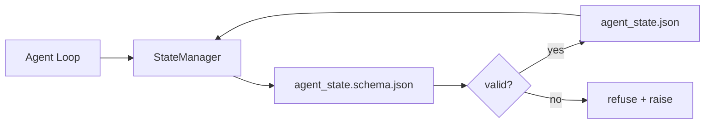

# Repo 记忆与持久 State

> 聊天历史易变，repo 持久。workbench 把 agent state 存进带版本的文件，这样下一个 session、下一个 agent、下一个 reviewer 都从同一真相源读取。

**Type:** Build
**Languages:** Python (stdlib + `jsonschema` optional)
**Prerequisites:** Phase 14 · 32 (Minimal Workbench)
**Time:** ~60 minutes

## 学习目标

- 界定什么属于 repo memory、什么属于聊天历史。
- 为 `agent_state.json` 和 `task_board.json` 编写 JSON Schema。
- 构建一个 state manager，能原子地加载、验证、变更并持久化 state。
- 用 schema 在坏写入破坏 workbench 之前拒绝它们。

## 问题

agent 结束一个 session。聊天关闭。下一个 session 打开，问该从哪开始。模型说「让我看看文件」，读的是过时的 note，然后重做已经完成的工作。或者更糟：它重写了一个已完成的文件，因为没人告诉它这个文件已经完成了。

workbench 的修复是 repo memory：state 存在 repo 里的 JSON 文件中，按 schema 写入，原子持久化，在 code review 里对 diff 友好。聊天是转瞬即逝的 feed；repo 是记录系统。

## 概念



### 什么属于 repo memory

| 属于 | 不属于 |
|---------|-----------------|
| 当前 task id | 原始聊天记录 |
| 本 session 触及的文件 | token 级推理 trace |
| agent 做出的假设 | 「用户似乎很沮丧」 |
| 未解决的阻塞 | 采样出的补全 |
| 下一步动作 | 特定厂商的 model id |

判断标准是持久性：三个月后在一次 CI 重跑里，这个信息还有用吗？有，就进 repo；没有，就进 telemetry。

### Schema 优先的 state

JSON Schema 是契约。没有它，每个 agent 发明新字段，每个 reviewer 学一个新形状，每个 CI 脚本都得为过去的版本做特判。有了它，坏写入就是被拒绝的写入。

Schema 覆盖：

- 必需 key。
- 允许的 `status` 值。
- 禁止的值（例如数组用 `null`）。
- 模式约束（task id 匹配 `T-\d{3,}`）。
- 用于迁移的版本字段。

### 原子写入

State 写入必须扛过部分失败：写进 tempfile、fsync、rename 覆盖目标。state 文件是真相源；写了一半的文件比没有文件更糟。

### 迁移

当 schema 变化时，在 schema 升级旁附一个迁移脚本。state 文件带一个 `schema_version` 字段；manager 拒绝加载一个它无法迁移的版本的文件。

```figure
wb-state-persist
```

## Build It

`code/main.py` 实现：

- `agent_state.schema.json` 和 `task_board.schema.json`。
- 一个纯 stdlib 的验证器（JSON Schema 的子集：required、type、enum、pattern、items）。
- `StateManager.load`、`StateManager.update`、`StateManager.commit`，采用原子 temp-and-rename 写入。
- 一个变更 state、持久化、重新加载并证明往返一致的 demo。

运行它：

```
python3 code/main.py
```

脚本写入 `workdir/agent_state.json` 和 `workdir/task_board.json`，在两个 turn 间变更它们，并在每一步打印验证后的 state。

## 生产环境中的实际模式

四种模式把本课的最小实现变成多 agent monorepo 能赖以生存的东西。

**原子 temp-and-rename 不是可选项。** 一份 2026 年 3 月的 Hive 项目 bug 报告清晰地记录了这种失败模式：`state.json` 通过 `write_text()` 写入，异常被捕获并静默。部分写入让 session 在无信号的情况下对着损坏的 state 恢复。修复永远是：在目标同一目录下 `tempfile.mkstemp`、写入、`fsync`、`os.replace`（POSIX 和 Windows 上的原子 rename）。本课的 `atomic_write` 正是这样做的。

**每个非幂等 tool call 都带幂等键。** 如果 agent 在调用工具之后、checkpoint 结果之前崩溃，恢复会重试该 tool call。对读安全；对邮件、DB 插入、文件上传危险。模式是：在执行前把每个 tool call ID 记进 `pending_calls.jsonl`。重试时检查该 ID；若存在，跳过调用并使用缓存结果。Anthropic 和 LangChain 都在 2026 年的指引中指出了这点；LangGraph 的 checkpointer 出于同样原因持久化待处理写入。

**把大 artifact 与 state 分开。** 不要把 CSV、长记录或生成文件存进 `agent_state.json`。把 artifact 存为单独文件（或上传到对象存储），state 里只留路径。checkpoint 保持小而快；artifact 独立增长。

**审计用事件溯源，恢复用快照。** 每次变更都追加到事件日志（`state.events.jsonl`）；周期性地快照到 `state.json`。恢复读快照，然后重放快照时间戳之后的事件。这会花更多磁盘，但让你能逐字重放 agent 决策——在调试长时程 run 时必不可少。这与 Postgres 内部使用 WAL 的结构相同。

**Schema 迁移，否则拒绝加载。** `schema_version` 整数是契约。当 manager 加载一个未知版本的文件时，它拒绝读取。在 schema 升级旁附一个迁移脚本；`tools/migrate_state.py` 在每次启动时幂等地运行。

## Use It

在生产中：

- **LangGraph checkpointers。** 同样的思路，不同的存储。checkpointer 把图 state 持久化到 SQLite、Postgres 或自定义后端。本课教的 schema 是当 checkpointer 挂掉、你需要手工读 state 时用的东西。
- **Letta memory blocks。** 带结构化 schema 的持久 block（Phase 14 · 08）。同样的纪律，作用于长时程 persona。
- **OpenAI Agents SDK session store。** 可插拔后端、感知 schema。本课的 state 文件就是本地文件后端。

## Ship It

`outputs/skill-state-schema.md` 生成项目专属的 JSON Schema 对（state + board）、一个接上原子写入的 Python `StateManager`，以及一个迁移脚手架，让下一次 schema 升级不会破坏 workbench。

## 练习

1. 加一个 `last_human_touch` 时间戳。拒绝任何在人类编辑五秒内发生的 agent 写入。
2. 扩展验证器以支持 `oneOf`，使任务既可以是 build 任务也可以是 review 任务，二者必填字段不同。
3. 加一个 `schema_version` 字段，写从 v1 到 v2 的迁移（把 `blockers` 改名为 `risks`）。
4. 把存储后端从本地文件换成 SQLite。保持 `StateManager` API 完全一致。
5. 让两个 agent 以 50 ms 的写入竞态跑同一个 state 文件。会出什么问题，原子 rename 如何救你？

## 关键术语

| 术语 | 人们怎么说 | 它实际是什么意思 |
|------|----------------|------------------------|
| Repo memory | 「笔记文件」 | 在 repo 的受追踪文件里、按 schema 存储的 state |
| Schema 优先 | 「验证输入」 | 在写入者之前定义契约，拒绝漂移 |
| 原子写入 | 「直接 rename」 | 写 temp、fsync、rename，让部分失败无法损坏数据 |
| 迁移 | 「schema 升级」 | 把 vN state 变成 v(N+1) state 的脚本 |
| 记录系统 | 「真相源」 | workbench 视为权威的产物 |

## 延伸阅读

- [JSON Schema specification](https://json-schema.org/specification.html)
- [LangGraph checkpointers](https://langchain-ai.github.io/langgraph/concepts/persistence/)
- [Letta memory blocks](https://docs.letta.com/v1-sdk/memory/memory-blocks)
- [Fast.io, AI Agent State Checkpointing: A Practical Guide](https://fast.io/resources/ai-agent-state-checkpointing/) — 带幂等的 schema 优先 checkpointing
- [Fast.io, AI Agent Workflow State Persistence: Best Practices 2026](https://fast.io/resources/ai-agent-workflow-state-persistence/) — 并发控制、TTL、事件溯源
- [Hive Issue #6263 — non-atomic state.json writes silently ignored](https://github.com/aden-hive/hive/issues/6263) — 真实项目里的失败模式
- [eunomia, Checkpoint/Restore Systems: Evolution, Techniques, Applications](https://eunomia.dev/blog/2025/05/11/checkpointrestore-systems-evolution-techniques-and-applications-in-ai-agents/) — 从 OS 历史应用到 agent 的 CR 原语
- [Indium, 7 State Persistence Strategies for Long-Running AI Agents in 2026](https://www.indium.tech/blog/7-state-persistence-strategies-ai-agents-2026/)
- [Microsoft Agent Framework, Compaction](https://learn.microsoft.com/en-us/agent-framework/agents/conversations/compaction) — 厂商 checkpoint manager
- Phase 14 · 08 — memory blocks 与 sleep-time compute
- Phase 14 · 32 — 本课为之加 schema 的三文件最小实现
- Phase 14 · 40 — 从同一 schema 读取的 handoff packet