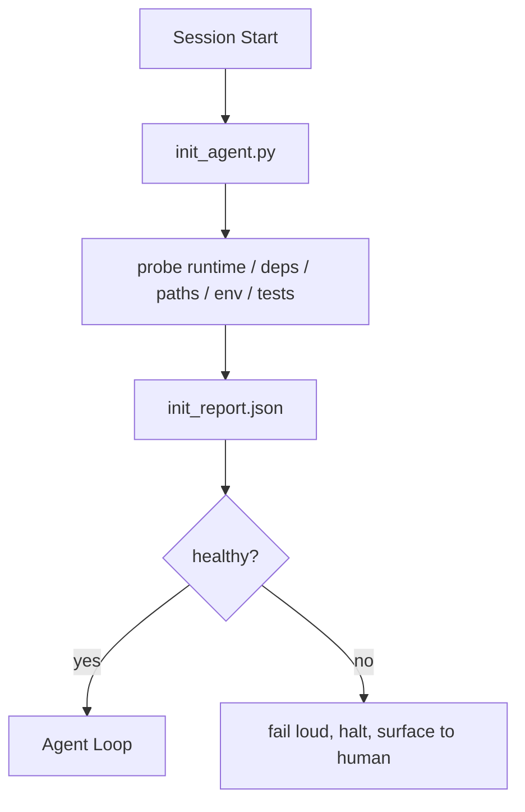

# Agent 的初始化脚本

> 每个冷启动的 session 都要缴一次税。agent 读同样的文件、重试同样的 probe、重新发现同样的路径。init script 只缴一次税，并把答案写进 state。

**Type:** Build
**Languages:** Python (stdlib)
**Prerequisites:** Phase 14 · 32 (Minimal Workbench), Phase 14 · 34 (Repo Memory)
**Time:** ~45 minutes

## 学习目标

- 识别 agent 在每个 session 里绝不该重做的工作。
- 构建一个确定性的 init script，探测 runtime、依赖和 repo 健康度。
- 持久化探测结果，让 agent 读取结果而非重跑检查。
- 初始化失败时大声、快速、并只在唯一一处呈现地失败。

## 问题

打开一个 session。agent 猜 Python 版本。猜测试命令。为了找入口点把 repo 根目录列了五遍。试图 import 一个未安装的包。问用户配置文件在哪里。等它做出真正的编辑时，一万个 token 已经花在了本应是一个脚本完成的 setup 工作上。

修复办法是：一个在 agent 做任何事之前运行、并写出一份 agent 启动时读取的 `init_report.json` 的 init script。

## 概念



### init script 探测什么

| Probe | 为什么重要 |
|-------|----------------|
| Runtime 版本 | 错误的 Python 或 Node 版本意味着静默的版本错配 bug |
| 依赖可用性 | 一个缺失的包，事后发现的成本是现在抓住它的十倍 |
| 测试命令 | agent 必须知道如何验证；如果命令缺失，workbench 就是坏的 |
| Repo 路径 | 硬编码路径会漂移；解析一次并 pin 住 |
| 环境变量 | 缺失的 `OPENAI_API_KEY` 是失败面，不是运行时谜团 |
| State + board 新鲜度 | 崩溃 session 留下的陈旧 state 是一颗地雷 |
| Last-known-good 提交 | session 结束时 handoff diff 的锚点 |

### 大声失败、快速失败、在唯一一处失败

probe 失败意味着停机并呈报给人类。没有「agent 会自己搞定的」。init 的全部意义就是在 workbench 坏掉时拒绝对外启动。

### 幂等

连续运行两次。第二次运行除了新时间戳外应是 no-op。幂等性是让你能把脚本接入 CI、hook 或 pre-task slash command 的关键。

### Init 与启动规则

规则（Phase 14 · 33）描述「要行动必须为真」的条件。Init 是确立「这些规则可以被检查」的脚本。没有 init 的规则变成「小心点」。没有规则的 init 变成一次精致的失败。

```figure
wb-init-probes
```

## Build It

`code/main.py` 实现了 `init_agent.py`：

- 五个 probe：Python 版本、通过 `importlib.util.find_spec` 列出的依赖、测试命令可解析性、必需环境变量、state 文件新鲜度。
- 每个 probe 返回 `(name, status, detail)`。
- 脚本写出完整 probe set 的 `init_report.json`，并在任何 block 级 probe 失败时以非零退出。

运行它：

```
python3 code/main.py
```

脚本打印 probe 表格、写出 `init_report.json`，happy path 以零退出，否则以非零退出并附失败 probe 列表。

## 生产环境中的实际模式

三种模式区分了「有用的 init script」和「仪式」。

**Last-known-good 提交锚定。** 把当前提交对上上次成功合并时写下的 `LKG` 文件做 diff。如果 diff 超过预算（默认 50 个文件），拒绝启动并要求人类背书新基线。这正是 Cloudflare 的 AI Code Review 用来限定 reviewer agent 作用域的做法：每次 review session 都对同一 last-known-good 做锚定，绝不让漂移跨 session 累积。

**带 TTL 的 lock 文件。** 第一次成功的 probe pass 之后写一个 `prereqs.lock`。后续运行在 N 小时内（默认 24h）信任该 lock 并跳过昂贵的 probe。init script 先读 lock；如果它是新鲜的且依赖 manifest 哈希匹配，就短路。这与 Docker 用于层缓存的模式相同：幂等 probe + 内容哈希 = 跳过。

**热路径上没有网络、没有 LLM、没有意外。** Init probe 是确定性的管道。一个调用 LLM 来给失败分类、或访问外部服务来查 license 的 probe 不是 probe，而是一个工作流。如果某个 probe 在 dry run 中超过三秒，把它当作 workbench 异味处理——要么移出 init，要么缓存其结果。

## Use It

在生产中：

- **Claude Code hooks。** `pre-task` hook 调用 init script，失败则拒绝启动 agent。
- **GitHub Actions。** 一个 `setup-agent` job 运行 init script；agent job 依赖它。
- **Docker entrypoint。** agent 容器在 exec agent runtime 之前运行 init script；失败时日志浮出。

init script 可移植，因为它不调用任何特定框架。Bash、Make 或 tasks 文件都能包一层。

## Ship It

`outputs/skill-init-script.md` 访谈项目、把它的 setup 工作归类成 probe，并产出一个项目专属的 `init_agent.py` 加一个在任何 agent 步骤之前运行它的 CI workflow。

## 练习

1. 加一个 probe，把当前提交对 last-known-good 提交做 diff，超过 50 个文件变更就拒绝启动。
2. 让脚本写一个 `prereqs.lock` 文件，lock 超过七天就拒绝启动。
3. 加一个 `--fix` 标志，自动安装缺失的 dev 依赖，但未经批准绝不改动 runtime 依赖。
4. 把 probe 从硬编码函数移到 YAML registry。论证这一权衡。
5. 每个 probe 加时间预算。运行超过三秒的 probe 是 workbench 异味。

## 关键术语

| 术语 | 人们怎么说 | 它实际是什么意思 |
|------|----------------|------------------------|
| Probe | 「一次检查」 | 返回 `(name, status, detail)` 的确定性函数 |
| Init report | 「setup 输出」 | 与 state 并排、带 probe 结果的 JSON |
| 幂等 | 「重跑安全」 | 连续两次运行产生除时间戳外相同的 report |
| 大声失败 | 「别吞掉」 | 停机并呈报给人类；不做静默回退 |
| Setup 税 | 「bootstrap 成本」 | agent 每 session 重新发现显而易见之事所花的 token |

## 延伸阅读

- [Anthropic, Effective harnesses for long-running agents](https://www.anthropic.com/engineering/effective-harnesses-for-long-running-agents)
- [GitHub Actions, composite actions for setup](https://docs.github.com/en/actions/sharing-automations/creating-actions/creating-a-composite-action)
- [microservices.io, GenAI dev platform: guardrails](https://microservices.io/post/architecture/2026/03/09/genai-development-platform-part-1-development-guardrails.html) — pre-commit + CI 检查作为 init
- [Augment Code, How to Build Your AGENTS.md (2026)](https://www.augmentcode.com/guides/how-to-build-agents-md) — init 预期
- [Codex Blog, Codex CLI Context Compaction](https://codex.danielvaughan.com/2026/03/31/codex-cli-context-compaction-architecture/) — 作为感知压缩的 session 启动 init
- Phase 14 · 33 — 本脚本所支撑的 rule set
- Phase 14 · 34 — 本脚本所播种的 state 文件
- Phase 14 · 38 — init script 所喂给的 verification gate
- Phase 14 · 40 — 消费 init report 的 last-known-good 的 handoff