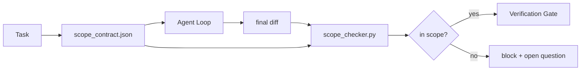

# Scope Contract 与任务边界

> 模型不知道工作在哪结束。scope contract 是一个每任务文件，说明工作从哪开始、到哪结束，以及溢出时如何回滚。contract 把「stay in scope」从愿望变成检查。

**Type:** Build
**Languages:** Python (stdlib)
**Prerequisites:** Phase 14 · 32 (Minimal Workbench), Phase 14 · 33 (Rules as Constraints)
**Time:** ~50 minutes

## 学习目标

- 写一份 agent 在任务开始时读取、verifier 在任务结束时读取的 scope contract。
- 指定允许文件、禁止文件、验收标准、回滚计划和审批边界。
- 实现一个 scope checker，把 diff 与 contract 比对并标记违规。
- 让 scope creep 可见、自动且可 review。

## 问题

Agent 会越界。任务是「修复登录 bug」。diff 却触及了登录路由、邮件 helper、数据库驱动、README 和发布脚本。每一次触及在当时都有一个说得通的理由。合在一起，它们已不是当初被 review 的那个改动了。

Scope creep 是 agent 工作中监控最不足的失败模式，因为 agent 每一步都诚心诚意地叙述。修复不是更严格的 prompt，而是磁盘上一份写明承诺的 contract，以及一个把结果与承诺比对的检查。

## 概念



### scope contract 里放什么

| 字段 | 用途 |
|-------|---------|
| `task_id` | 关联 board 上的任务 |
| `goal` | reviewer 能验证的一句话 |
| `allowed_files` | agent 可以写的 glob |
| `forbidden_files` | agent 哪怕意外也不许碰的 glob |
| `acceptance_criteria` | 证明完成的测试命令或断言行 |
| `rollback_plan` | 需要停机时操作员可执行的一段话 |
| `approvals_required` | 范围之外、需要明确人工签字的动作 |

没有 `forbidden_files` 的 contract 是不完整的。负空间是 contract 的一半。

### Glob，而非裸路径

真实 repo 会移动文件。把 contract pin 到 glob（`app/**/*.py`、`tests/test_signup*.py`），这样 session 之间的一次重构不会让 contract 失效。

### 回滚是 scope 的一部分

列出如何回滚会迫使 contract 作者思考什么可能出错。一份你无法从中回滚的 contract，是一份不该被批准的 contract。

### Scope check 是 diff 检查

agent 写出一个 diff。checker 读取 diff、允许 glob、禁止 glob，以及运行过的验收命令列表。每个违规都是一个带标签的 finding，verification gate 可以据此拒绝。

### Scope 的两个高度：feature list 与任务 contract

Scope contract 界定一个任务。它不界定整个项目。一个 agent 可以在登录修复的 contract 内完美行事，却在下个 turn 决定项目还需要一个设置页、一个深色模式开关和一次路由重写。contract 从没被问过哪些工作属于项目的 scope，只被问过哪些文件属于任务的 scope。

第二个高度需要它自己的原语：一个 agent 在 session 开始读取的 `feature_list.json`。它是机器可读、有序的项目 backlog。agent 恰好挑一个 `status` 为 `todo` 的 feature，把它的 `id` 写进 active scope contract，并被禁止在同一 session 里开始第二个 feature。「一次一个 feature」不再是一句 agent 能合理化的 prompt 台词，而变成它从磁盘读到的值，以及 gate 强制执行的检查。

```json
{
  "project": "knowledge-base",
  "active": "import-pdf",
  "features": [
    { "id": "import-pdf",   "status": "in_progress", "goal": "import a PDF into the library",        "done_when": "pytest tests/test_import.py && a sample PDF appears in the library view" },
    { "id": "full-text-search", "status": "todo",     "goal": "search document text and rank hits",   "done_when": "query returns ranked results with snippets" },
    { "id": "cite-answers", "status": "todo",         "goal": "answers carry source citations",        "done_when": "every answer renders at least one clickable citation" }
  ]
}
```

| 字段 | 用途 |
|-------|---------|
| `active` | 当前 session 唯一可触碰的 feature；为空意味着挑一个并设置它 |
| `features[].id` | scope contract 的 `task_id` 所指向的稳定 slug |
| `features[].status` | `todo`、`in_progress`、`done`、`blocked`；同一时刻只有一个 `in_progress` |
| `features[].goal` | reviewer 能验证的一句话 |
| `features[].done_when` | 把 `in_progress` 翻成 `done` 的验收行 |

两条规则让这份 list 成为承重而非装饰。第一，不变式「至多一个 `in_progress`」本身就是一条启动检查（Phase 14 · 33）：如果 list 显示两个，session 拒绝启动，直到人类解决。第二，feature list 是文件，而非聊天消息，因为聊天会滚出上下文，而文件跨 session、跨 agent 持久。handoff（Phase 14 · 40）把已完成 feature 的 status 写回 `done`，这样下一个 session 打开时看到的是准确的 board，而不是重新推导还剩什么。

Contract 与 list 通过最小权限组合，正是下文描述的 merge：任务 contract 的 `allowed_files` 必须落在 active feature 所触碰的范围之内，绝不在其外。

```figure
wb-scope-bounce
```

## Build It

`code/main.py` 实现：

- `scope_contract.json` schema（JSON Schema 的子集，glob 数组）。
- 一个 diff 解析器，把触碰文件列表加运行命令列表转成 `RunSummary`。
- 一个 `scope_check`，针对 contract 返回 `(violations, in_scope, off_scope)`。
- 两个 demo run：一个留在 scope 内，一个越界。checker 用确切文件和原因标记越界。

运行它：

```
python3 code/main.py
```

输出：contract、两次 run、每次 run 的判定，以及保存的 `scope_report.json`。

## 生产环境中的实际模式

一位运行「specsmaxxing」（在调用 agent 前用 YAML 写 scope contract）的实践者报告，rabbit-hole 率三周内从 52% 降到 21%，而 agent 没变。起作用的 contract，不是模型。三种模式让收益稳固。

**违规预算，而非二值失败。** `agent-guardrails`（Claude Code、Cursor、Windsurf、Codex 经 MCP 使用的 OSS merge gate）为每个任务发一个 `violationBudget`：预算内的轻微 scope 滑动作为警告呈现；只有预算超出时 merge gate 才拒绝。配合 `violationSeverity: "error" | "warning"`。预算是一个能真正落地、和一个会被讨厌它的团队禁掉的 gate 之间的区别。

**按路径族做严重度非对称。** 对 `docs/**` 的越界写入通常是 `warn`；对 `scripts/**`、`migrations/**`、`config/prod/**` 的越界写入永远是 `block`。这种非对称必须写在 contract 里，而不是 runtime 里，因为它是项目专属、且随任务变化的。

**时间与网络预算，紧邻文件预算。** `time_budget_minutes` 字段约束墙钟时间；超过后未经重新批准 runtime 拒绝继续。`network_egress` 主机名允许列表防止 agent 悄悄访问不属于任务的某个外部 API。这些也是 scope 维度；文件 glob 必要但不充分。

**多 contract merge 语义（最小权限）。** 当两份 scope contract 同时适用（例如一份项目级 contract 加一份任务级 contract）时，merge 规则是：`allowed_files` 取**交集**（两份 contract 都必须允许该路径），`forbidden_files` 取**并集**（任一份都可禁止），`time_budget_minutes` 取最严格者（min），`approvals_required` 累加。`network_egress` 为 `None` 表示不强制、`[]` 表示全拒、`[...]` 表示允许列表；merge 时 `None` 服从另一方、两个列表取交集、全拒保持全拒。把这些写在 contract schema 里，使 merge 机械且可 review。

## Use It

生产模式：

- **Claude Code slash commands。** 一个 `/scope` 命令写 contract 并 pin 为 session 上下文。subagent 在行动前读取 contract。
- **GitHub PRs。** 把 contract 作为 JSON 文件放进 PR body 或作为受检入的 artifact。CI 针对 merge diff 运行 scope checker。
- **LangGraph interrupts。** scope 违规触发 interrupt；handler 询问人类是 contract 需要扩展，还是 agent 需要退让。

Contract 随任务走。任务关闭时，contract 归档到 `outputs/scope/closed/` 下。

## Ship It

`outputs/skill-scope-contract.md` 为一份任务描述生成 scope contract，以及一个在每个 agent diff 上于 CI 中运行的 glob 感知 checker。

## 练习

1. 加一个 `network_egress` 字段，列出允许的外部主机。拒绝触及其他主机的 run。
2. 扩展 checker，对 `docs/**` 软失败、对 `scripts/**` 硬失败。论证这一非对称。
3. 让 contract 用一套静态规则（不用 LLM）从 `goal` 字段推导 `allowed_files`。第一个边界情况会出什么错？
4. 加一个 `time_budget_minutes`，墙钟超过就拒绝继续。
5. 对同一个 diff 跑两份 contract。两者都适用时正确的 merge 语义是什么？

## 关键术语

| 术语 | 人们怎么说 | 它实际是什么意思 |
|------|----------------|------------------------|
| Scope contract | 「任务简报」 | 列明允许/禁止文件、验收、回滚的每任务 JSON |
| Scope creep | 「它还碰了……」 | 同一任务里 contract 之外的文件被改动 |
| 回滚计划 | 「我们可以 revert」 | 用于停机的一段操作员 runbook |
| 审批边界 | 「需要签字」 | contract 里列为需要明确人工批准的动作 |
| Diff 检查 | 「路径审计」 | 把触碰文件与 contract glob 比对 |

## 延伸阅读

- [LangGraph human-in-the-loop interrupts](https://langchain-ai.github.io/langgraph/concepts/human_in_the_loop/)
- [OpenAI Agents SDK tool approval policies](https://platform.openai.com/docs/guides/agents-sdk)
- [logi-cmd/agent-guardrails — merge gates and scope validation](https://github.com/logi-cmd/agent-guardrails) — 违规预算、严重度分级
- [Dev|Journal, Preventing AI Agent Configuration Drift with Agent Contract Testing](https://earezki.com/ai-news/2026-05-05-i-built-a-tiny-ci-tool-to-keep-ai-agent-configs-from-drifting-in-my-repo/) — 无外部依赖的 `--strict` 模式
- [Agentic Coding Is Not a Trap (production logs)](https://dev.to/jtorchia/agentic-coding-is-not-a-trap-i-answered-the-viral-hn-post-with-my-own-production-logs-33d9) — specsmaxxing 收据：52% → 21%
- [OpenCode permission globs](https://opencode.ai/docs/agents/) — 细粒度的每权限 scope
- [Knostic, AI Coding Agent Security: Threat Models and Protection Strategies](https://www.knostic.ai/blog/ai-coding-agent-security) — 作为最小权限一部分的 scope
- [Augment Code, AI Spec Template](https://www.augmentcode.com/guides/ai-spec-template) — 三层边界系统（must/ask/never）
- Phase 14 · 27 — 与 scope lock 配对的 prompt injection 防御
- Phase 14 · 33 — 本 contract 逐任务特化的 rule set
- Phase 14 · 38 — checker 汇报进去的 verification gate