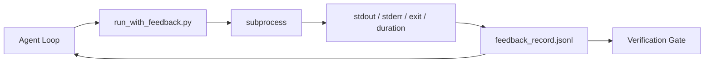

# Runtime Feedback Loop

> 看不到真实命令输出的 agent 只能猜。feedback runner 把 stdout、stderr、exit code 和耗时捕获成下个 turn 能读的结构化记录。然后 agent 对事实反应，而不是对自己预测的事实反应。

**Type:** Build
**Languages:** Python (stdlib)
**Prerequisites:** Phase 14 · 32 (Minimal Workbench), Phase 14 · 35 (Init Script)
**Time:** ~50 minutes

## 学习目标

- 区分 runtime feedback 与 observability telemetry。
- 构建一个包装 shell 命令并持久化结构化记录的 feedback runner。
- 确定性地截断大输出，使 loop 保持在 token 预算内。
- 当 feedback 缺失时拒绝推进 loop。

## 问题

agent 说「现在跑测试」。下一条消息说「所有测试通过」。现实是根本没有测试运行过。agent 臆想了输出，或者它跑了命令却没读结果，或者它读了结果却静默截掉了失败行。

feedback runner 消除这个缺口。每条命令都经过 runner。每条记录携带命令、捕获的 stdout 和 stderr、exit code、墙钟耗时，以及一行 agent note。agent 在下个 turn 读取该记录。verification gate 在任务结束时读取这些记录。

## 概念



### feedback record 里放什么

| 字段 | 为什么重要 |
|-------|----------------|
| `command` | 精确 argv，无 shell 展开意外 |
| `stdout_tail` | 最后 N 行，确定性截断 |
| `stderr_tail` | 最后 N 行，与 stdout 分开 |
| `exit_code` | 不模糊的成功信号 |
| `duration_ms` | 浮现慢 probe 和失控进程 |
| `started_at` | 用于回放的时间戳 |
| `agent_note` | agent 写的关于它预期的一行 |

### 截断是确定性的

一个 50 MB 的日志会毁掉 loop。runner 用 `...truncated N lines...` 标记截断头部和尾部，确定性意味着相同输出总是产生相同记录。不采样；agent 需要看到的部分（最终错误、最终总结）在尾部。

### Feedback 与 telemetry

Telemetry（Phase 14 · 23，OTel GenAI conventions）服务于跨越时间 review run 的人类操作员。Feedback 服务于本次 run 的下个 turn。它们共享字段，但存在不同文件里、保留策略不同。

### 没有 feedback 就拒绝推进

如果 runner 在捕获 exit 之前出错，记录带 `exit_code: null` 和 `error: <reason>`。agent loop 必须拒绝在 `null` exit 上宣称成功。没有 exit，就没有进展。

```figure
wb-feedback-loop
```

## Build It

`code/main.py` 实现：

- `run_with_feedback(command, agent_note)`，包装 `subprocess.run`，捕获 stdout/stderr/exit/duration，确定性截断，追加到 `feedback_record.jsonl`。
- 一个小 loader，把 JSONL 流式读进 Python 列表。
- 一个 demo，跑三条命令（成功、失败、慢），并打印每条命令的最后一条记录。

运行它：

```
python3 code/main.py
```

输出：三条 feedback record 追加到 `feedback_record.jsonl`，每条打印其最后一条。跨多次重跑 tail 该文件，看 loop 累积。

## 生产环境中的实际模式

三种模式把 runner 加固到可交付。

**写时脱敏，而非读时。** 任何触及 stdout 或 stderr 的记录都可能泄漏 secret。runner 在 JSONL 追加前做一遍脱敏：剥掉匹配 `^Bearer `、`password=`、`api[_-]?key=`、`AKIA[0-9A-Z]{16}`（AWS）、`xox[baprs]-`（Slack）的行。读时脱敏是颗地雷；磁盘上的文件才是攻击者触及的东西。每季度对照生产 runtime 观测到的 secret 格式审计脱敏模式。

**轮转策略，而非单文件。** 每个文件把 `feedback_record.jsonl` 封顶在 1 MB；溢出时轮转到 `.1`、`.2`，丢弃 `.5`。agent 的 loop 只读当前文件，所以运行时成本有界。CI artifact 存储得到完整的轮转集。没有轮转，文件会成为每次 loader 调用的瓶颈。

**重试链的父命令 id。** 每条记录带 `command_id`；重试带指向上一次尝试的 `parent_command_id`。reviewer 的「失败尝试」列表（Phase 14 · 40）和 verification gate 的审计都沿这条链走。没有这个链接，重试看起来像各自独立的成功，审计就隐藏了失败历史。

## Use It

生产模式：

- **Claude Code Bash tool。** 该工具已捕获 stdout、stderr、exit 和 duration。本课的 runner 是任何 agent 产品的框架无关等价物。
- **LangGraph nodes。** 把任何 shell 节点包进 runner，使记录在图 state 之外持久。
- **CI logs。** 把 JSONL 导入你的 CI artifact 存储；reviewer 无需重跑 session 就能重放任何命令。

runner 是一个薄包装，能挺过每次框架迁移，因为它拥有记录的形状。

## Ship It

`outputs/skill-feedback-runner.md` 生成项目专属的 `run_with_feedback.py`，带正确的截断预算、一个接入 workbench 的 JSONL 写入器，以及 agent 每 turn 都读的 loader。

## 练习

1. 每条记录加一个 `cwd` 字段，使从不同目录跑的同一条命令可区分。
2. 加一个 `redaction` 步骤，剥掉匹配 `^Bearer ` 或 `password=` 的行。在 fixture 记录上测试。
3. 通过轮转到 `.1`、`.2` 文件把 `feedback_record.jsonl` 总大小封顶在 1 MB。论证轮转策略。
4. 加一个 `parent_command_id`，使重试链可见：哪条命令产出了下一条命令所消费的输入。
5. 把 JSONL 导入一个小 TUI，高亮最新非零 exit。为在 review 中有用，这个 TUI 必须展示的八个关键特性。

## 关键术语

| 术语 | 人们怎么说 | 它实际是什么意思 |
|------|----------------|------------------------|
| Feedback record | 「运行日志」 | 带命令、输出、exit、耗时的结构化 JSONL 条目 |
| 尾部截断 | 「裁剪日志」 | 确定性头+尾捕获，使记录符合 token 预算 |
| 拒绝 null | 「缺失数据即阻止」 | `exit_code` 为 null 时 loop 不得推进 |
| Agent note | 「预期标签」 | agent 在读结果前写下的一行预测 |
| Telemetry 分离 | 「两个日志文件」 | feedback 给下个 turn，telemetry 给操作员 |

## 延伸阅读

- [OpenTelemetry GenAI semantic conventions](https://opentelemetry.io/docs/specs/semconv/gen-ai/)
- [Anthropic, Effective harnesses for long-running agents](https://www.anthropic.com/engineering/effective-harnesses-for-long-running-agents)
- [Guardrails AI x MLflow — deterministic safety, PII, quality validators](https://guardrailsai.com/blog/guardrails-mlflow) — 作为回归测试的脱敏模式
- [Aport.io, Best AI Agent Guardrails 2026: Pre-Action Authorization Compared](https://aport.io/blog/best-ai-agent-guardrails-2026-pre-action-authorization-compared/) — tool 前/后捕获
- [Andrii Furmanets, AI Agents in 2026: Practical Architecture for Tools, Memory, Evals, Guardrails](https://andriifurmanets.com/blogs/ai-agents-2026-practical-architecture-tools-memory-evals-guardrails) — observability 面
- Phase 14 · 23 — telemetry 侧的 OTel GenAI conventions
- Phase 14 · 24 — agent observability 平台（Langfuse、Phoenix、Opik）
- Phase 14 · 33 — 要求在声明完成前提供 feedback 的规则
- Phase 14 · 38 — 读取 JSONL 的 verification gate