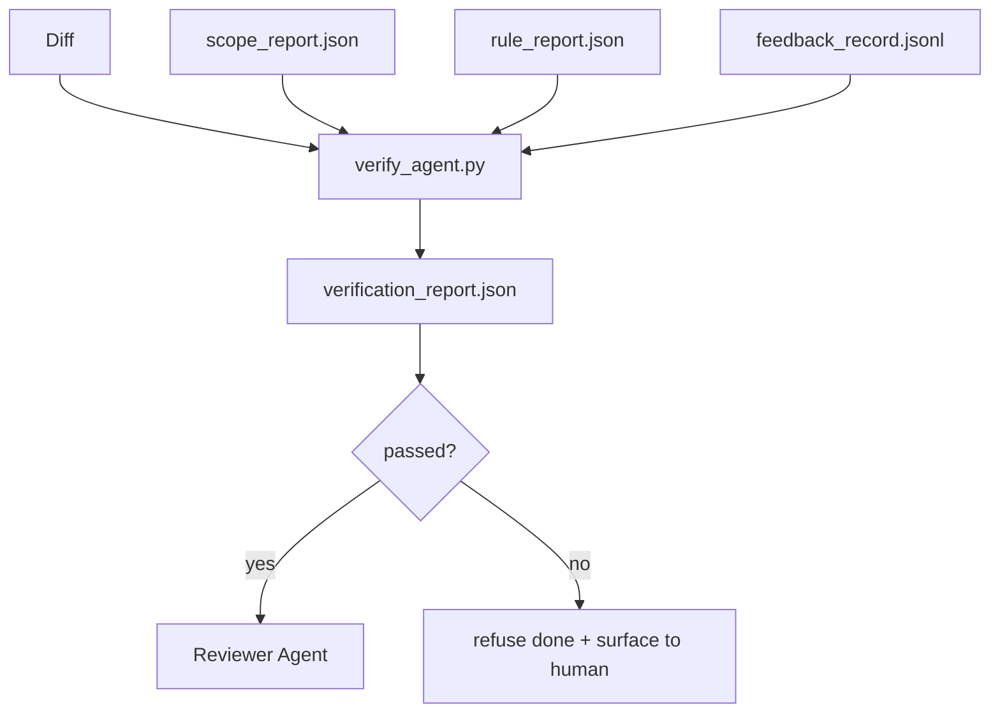

# Verification Gate

> agent 无权把自己的工作标记为完成。verification gate 读取 scope contract、feedback log、rule report 和 diff，回答一个问题：这个任务真的完成了吗？如果 gate 说不，任务就没完成，不管聊天里怎么说。

**Type:** Build
**Languages:** Python (stdlib)
**Prerequisites:** Phase 14 · 33 (Rules), Phase 14 · 36 (Scope), Phase 14 · 37 (Feedback)
**Time:** ~55 minutes

## 学习目标

- 把 verification gate 定义为 workbench artifact 之上的确定性函数。
- 把 rule report、scope report、feedback record 和 diff 合并成一个判定。
- 产出一份 reviewer agent 和 CI 都能读的 `verification_report.json`。
- 在任何 block 级失败上拒绝推进任务，无一例外。

## 问题

Agent 太容易宣称成功。三种失败形态占主导：

- 「看起来不错。」模型读了自己的 diff 就判定它正确。
- 「测试通过了。」说得很有信心。却没有测试真的运行过的记录。
- 「验收达成。」验收标准被宽松解释到「任何像完成的东西」。

workbench 的修复是一个单一的 verification gate，读取 agent 已经产出的 artifact 并做裁决。gate 是确定性的。gate 在版本控制里。gate 接入 CI。agent 无法收买它。

## 概念



### gate 检查什么

| 检查项 | 来源 artifact | 严重度 |
|-------|-----------------|----------|
| 所有验收命令都运行了 | `feedback_record.jsonl` | block |
| 所有验收命令都以零退出 | `feedback_record.jsonl` | block |
| Scope check 无禁止写入 | `scope_report.json` | block |
| Scope check 无越界写入 | `scope_report.json` | block 或 warn |
| 所有 block 级规则通过 | `rule_report.json` | block |
| feedback 中无 `null` exit code | `feedback_record.jsonl` | block |
| 触碰文件匹配 `scope.allowed_files` | 两者 | warn |

`warn` finding 注释判定；`block` finding 阻止 `passed: true`。

### 确定性，而非概率性

gate 必须对同一组 artifact 每次都产出相同判定。没有 LLM 裁判。LLM 裁判属于 reviewer 侧（Phase 14 · 39），那里的目标是定性评估，而非状态。

### 一份 report，一条路径

gate 在每次任务收尾时产出一份 `verification_report.json`，写到 `outputs/verification/<task_id>.json`。CI 消费同一条路径。多个 gate 用不同路径会分叉真相源。

### 拒绝，无一例外

Block 级 finding 不能被 agent 覆盖。只能被人类覆盖，并记录 `override_reason` 和 `overridden_by` 用户 id。覆盖是一次签名变更，而非 agent 决定。

```figure
wb-gate-sequence
```

## Build It

`code/main.py` 实现：

- 每个输入 artifact 的 loader，全部在本地 stub，使本课自包含。
- 一个纯函数 `verify(task_id, artifacts) -> VerdictReport`。
- 一个显示每项检查结果和最终 pass/fail 的 printer。
- 一个带三种任务场景的 demo：干净通过、scope creep、缺失验收。

运行它：

```
python3 code/main.py
```

输出：三份判定 report，每份保存在脚本旁。

## 生产环境中的实际模式

四种模式把 gate 从「又一个 lint job」提升到「决定性的边界」。

**纵深防御，而非单一 gate。** Pre-commit hook → CI status check → pre-tool authz hook → pre-merge gate。每一层都确定性，因此一层的失败被下一层接住。microservices.io 的 2026 年 3 月手册很明确：pre-commit hook 不可绕过，因为它不像模型侧 skill，不依赖 agent 遵循指令。verification gate 位于 CI / pre-merge 层。

**用确定性检查防御，模型裁判只用于微妙处。** Anthropic 的 2026 年 Hybrid Norm 配对：可验证 reward（单元测试、schema 检查、exit code）回答「代码解决问题了吗？」——LLM rubric 回答「代码可读、安全、符合风格吗？」gate 跑第一类；reviewer（Phase 14 · 39）跑第二类。混在一起会塌缩信号。

**签名覆盖日志，而非 Slack 讨论串。** 每次覆盖在 `outputs/verification/overrides.jsonl` 里产出一行：时间戳、finding code、原因、签名用户、当前 HEAD 提交。runtime 拒绝任何缺签名的覆盖；审计轨迹受 git 追踪。这是覆盖政策与覆盖作秀之间的界线。

**覆盖率下限作为一等检查。** `coverage_report.json` 喂给一个 `coverage_floor`（默认 80%）检查。如果实测覆盖率跌破下限、或比上次合并的下限低超过 1 个百分点，gate 失败。没有这个检查，agent 会悄悄删掉失败的测试，verification report 却保持绿色。

**`--strict` 模式把 warn 提升为 block。** 对 release 分支、阻塞交付的 PR 或事故后分诊，`--strict` 让每条警告都变成硬失败。该标志按分支 opt-in；不是全局默认，因为对一切严格会腐蚀日常流程。

## Use It

生产模式：

- **CI 步骤。** 一个 `verify_agent` job 针对 agent 的最终 artifact 跑 gate。没有 `passed: true` merge protection 就拒绝。
- **Pre-handoff hook。** agent runtime 在生成 handoff 文档前调用 gate。没有绿色判定，就没有 handoff。
- **人工分诊。** 当 agent 宣称成功而人类怀疑时，操作员读 report。

gate 是 workbench 流程中的决定性边界。其他每个面都在它的上游。

## Ship It

`outputs/skill-verification-gate.md` 把 gate 接入具体项目：哪些验收命令喂给它、哪些规则是 block 级、哪些越界写入被容忍、覆盖审计日志如何存储。

## 练习

1. 加一个 `coverage_floor` 检查：测试命令必须产出至少 80% 的覆盖率报告。决定哪个 artifact 承载该下限。
2. 支持 `--strict` 模式，把每条 `warn` 提升为 `block`。记录 strict 模式是正确默认值的场景。
3. 让 gate 除 JSON 外再产出 Markdown 摘要。论证哪些字段属于摘要。
4. 加一个 `time_since_last_human_touch` 检查：人类按键 60 秒内编辑的任何文件免于越界标记。
5. 在你产品的真实 agent diff 上跑 gate。多少 finding 是真实的、多少是噪音？gate 需要在哪成长？

## 关键术语

| 术语 | 人们怎么说 | 它实际是什么意思 |
|------|----------------|------------------------|
| Verification gate | 「拦下东西的检查」 | 产出 pass/fail 判定的、作用于 workbench artifact 的确定性函数 |
| Block 严重度 | 「硬失败」 | 阻止 `passed: true` 且需签名覆盖的 finding |
| 覆盖日志 | 「为什么放行」 | 带原因和用户 id 的签名条目，由 review 审计 |
| 验收命令 | 「证明」 | 零退出即 `done` 含义的一条 shell 命令 |
| 单一 report 路径 | 「真相源」 | CI 与人类共同消费的 `outputs/verification/<task_id>.json` |

## 延伸阅读

- [Anthropic, Harness design for long-running application development](https://www.anthropic.com/engineering/harness-design-long-running-apps)
- [OpenAI Agents SDK guardrails](https://openai.github.io/openai-agents-python/guardrails/)
- [microservices.io, GenAI dev platform: guardrails](https://microservices.io/post/architecture/2026/03/09/genai-development-platform-part-1-development-guardrails.html) — pre-commit 与 CI 之间的纵深防御
- [ICMD, The 2026 Playbook for Agentic AI Ops](https://icmd.app/article/the-2026-playbook-for-agentic-ai-ops-guardrails-costs-and-reliability-at-scale-1776661990431) — 审批 gate 阶梯（draft → approval → 阈值下自动）
- [Type-Checked Compliance: Deterministic Guardrails (arXiv 2604.01483)](https://arxiv.org/pdf/2604.01483) — Lean 4 作为确定性 gating 的上界
- [logi-cmd/agent-guardrails — merge gate spec](https://github.com/logi-cmd/agent-guardrails) — scope + 变异测试 gate
- [Guardrails AI x MLflow](https://guardrailsai.com/blog/guardrails-mlflow) — 作为 CI scorer 的确定性 validator
- Phase 14 · 27 — prompt injection 防御（gate 的对抗配对）
- Phase 14 · 36 — 本 gate 所强制执行的 scope contract
- Phase 14 · 37 — 本 gate 所打分的 feedback log
- Phase 14 · 39 — gate 交棒给的 reviewer agent