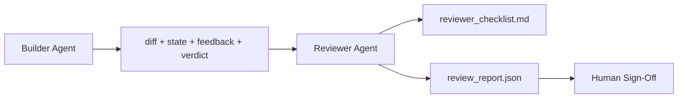

# Reviewer Agent：将 Builder 与 Marker 分离

> 写出代码的 agent 不能给自己的代码打分。reviewer 是第二个 loop——拥有不同的 system prompt、不同的目标，以及对 builder 产出的一切内容的只读访问权限。大多数可靠性正是来自 builder 与 reviewer 之间的这个差距。

**Type:** Build
**Languages:** Python (stdlib)
**Prerequisites:** Phase 14 · 38 (Verification Gate)
**Time:** ~55 minutes

## 学习目标

- 说明为什么同一个 agent 无法可靠地审查自己的工作。
- 构建一个 reviewer agent loop，消费 builder 的产物并生成结构化的 review report。
- 编写一份按具体维度打分（而非凭感觉）的 reviewer rubric。
- 把 reviewer 接入 workbench，使人类审查步骤从一份真实的产物开始，而非从空白开始。

## 问题

你让 agent 修复一个 bug。它修改了四个文件、运行了测试，然后报告完成。verification gate（Phase 14 · 38）确认 acceptance 已运行、scope 得到遵守。gate 显示 `passed: true`。你合入。两天后你发现，这个修复解决的是 bug 错误的那一半。

Acceptance 是必要的，但并不充分。reviewer 会提出 acceptance 无法提出的问题：它解决的是正确的问题吗？它是否在未经标注的情况下扩大了 scope？它是否记录下了本应被质疑的 assumptions？它是否把 workbench 留在了下一个 session 可以接着用的状态？

## 概念



### 评分 rubric

五个维度，每个维度 0 到 2 分。

| 维度 | 问题 |
|-----------|----------|
| Problem fit | 这次改动解决的是任务所陈述的问题，还是旁边一个相似的问题？ |
| Scope discipline | 编辑是否被限制在 contract 内，还是 contract 被有意地扩大了？ |
| Assumptions | 所有隐藏的 assumptions 是否都写在了某处可供审查的地方？ |
| Verification quality | acceptance 命令真的证明了目标，还是只证明了一个更弱的版本？ |
| Handoff readiness | 下一个 session 能否干净地从当前状态接手？ |

总分 10 分。低于 7 分是 soft fail；低于 5 分是 hard fail。

### reviewer 是独立角色，而非独立模型

reviewer 可以和 builder 用同一个模型运行。纪律在于角色分离：不同的 system prompt、不同的输入、对 diff 没有写权限。姿态的改变就是信号的改变。

### reviewer 不能修改 diff

reviewer 读取 diff、state、feedback、verdict。它写一份 report。它不改动 diff。如果 report 说「修复这个」，由下一轮 builder 来做修复；reviewer 继续回去审查。混用角色会毁掉这个差距。

### 评分 rubric 与 verification gate

gate（Phase 14 · 38）检查确定性事实：acceptance 是否运行了、rules 是否通过、scope 是否守住。reviewer 做定性判断：这是否是正确的工作、是否有文档记录、handoff 是否可用。两者都需要。

```figure
wb-builder-marker
```

## Build It

`code/main.py` 实现：

- 一个 `ReviewerInputs` dataclass，打包 reviewer 读取的 artifact。
- 一个 rubric scorer，每个维度一个函数。每个函数对本课而言是确定性的 stub 级别；真实实现会调用 LLM。
- 一个 `review_report.json` writer，包含五个分数、总分和一个 verdict（`pass`、`soft_fail`、`hard_fail`）。
- 两个 demo 用例：一个干净的改动，和一个「测试对了、问题错了」的改动。

运行它：

```
python3 code/main.py
```

输出：两份写到磁盘的 review report，以及一个各维度分数的控制台表格。

## 生产环境中的实际模式

实证数据：Cloudflare 2026 年 4 月的 AI Code Review 系统在 30 天里、跨 5,169 个仓库、在 48,095 个 merge request 上运行了 131,246 次 review run。中位 review 在 3 分 39 秒内完成。多达七名 specialist reviewer（security、performance、code quality、docs、release management、compliance、Engineering Codex）在一位 Review Coordinator 的调度下并行运行，后者负责去重 findings 并判定严重度。顶级模型专门留给 coordinator；specialists 跑在更便宜的层级上。

四个模式让这一切在规模上成立。

**Specialist 池，而非一个大 reviewer。** 一个带 5 维 rubric 的 reviewer 对单人仓库够用。一旦 codebase 有了 security 关键、performance 关键和 docs 等表面，就拆成 prompt 更小的 specialists。coordinator 负责去重；specialists 从不需要跑完整 rubric。模型层级分离随之而来：便宜的 specialists、昂贵的 coordinator。

**Bias 缓解是设计要求，而非优化项。** LLM 裁判表现出四种稳定的 bias（Adnan Masood，2026 年 4 月）：position bias（GPT-4 在 (A,B) 与 (B,A) 顺序上约有 40% 不一致）、verbosity bias（对更长输出约有 15% 的分数通胀）、self-preference（裁判偏爱来自同一模型家族的输出）、authority（裁判对知名作者的引用给予过高评分）。缓解措施：两种顺序都评估、只计一致取胜的结果；使用明确奖励简洁的 1-4 分制；让裁判跨模型家族轮换；打分前去掉作者名。

**Calibration set，而非凭感觉。** 一个 10-20 个任务的历史集合，带已知正确 verdict。每次改 prompt 都在它上面跑 reviewer。如果与历史记录的一致率低于 80%，rubric 在 reviewer 上线前就需要修订。这是每个团队最终都会重新发现的东西；最好从一开始就做。

**与 gate 的混合规范。** verification gate（Phase 14 · 38）处理确定性检查（acceptance 是否运行、测试是否通过、scope 是否守住）。reviewer 处理语义检查（这是否是正确的工作、assumptions 是否有记录、handoff 是否可用）。Anthropic 2026 年的指导对这一划分很明确：不要让 reviewer 重做 gate 已经证明过的事。

## Use It

生产模式：

- **Claude Code subagents。** 一个 reviewer subagent 在 builder 收尾一个任务后运行。它以 rubric 分数在 PR 上发一条评论。
- **OpenAI Agents SDK handoffs。** builder 在任务完成时交棒给 reviewer。reviewer 可以带着一列 findings 交回，或上交到人类。
- **双模型配对。** builder 跑在更快更便宜的模型上。reviewer 跑在更强的模型上、使用更小的 context，专注于判断。

当人类无法亲自做每一次 review 时，reviewer 就是 workbench 长出的第二双眼睛。

## Ship It

`outputs/skill-reviewer-agent.md` 生成一个项目专属的 reviewer rubric、一个接入 builder artifact 的 reviewer agent stub，以及与 verification gate 的集成，使人类审查从一份写好的 report 开始，而非从空白页开始。

## 练习

1. 增加一个针对你产品领域的第六维度。论证为什么它没有被现有五维吸收。
2. 用两种不同的 system prompt（简练、冗长）运行 reviewer。哪一种产出的 report 人类更可能去读？
3. 给每个维度加一个 `confidence` 字段。当最低维度的 confidence 低于 0.6 时，拒绝发布 report。
4. 构建一个 calibration set：10 个带已知正确 verdict 的历史任务收尾。在上面跑 reviewer。它在哪些地方与历史记录不一致？
5. 增加一个「请求更多证据」的能力：reviewer 可以在打分前向 builder 请求一次具体的测试运行。怎样退避才不会让它陷入死循环？

## 关键术语

| 术语 | 人们怎么说 | 它实际是什么意思 |
|------|----------------|------------------------|
| Reviewer rubric | 「清单」 | 五个维度、每维 0-2 分、每维带一个书面问题 |
| Soft fail | 「需要修改」 | 总分低于 7；builder 拿到 findings 去处理 |
| Hard fail | 「驳回」 | 总分低于 5 或任一维度为 0；停止并上报给人类 |
| Role separation | 「不同的 prompt」 | 同一模型可身兼两角；纪律在于输入与姿态 |
| Confidence floor | 「别发布低信号 report」 | 当 rubric 不确定时，拒绝给出 verdict |

## 延伸阅读

- [OpenAI Agents SDK handoffs](https://openai.github.io/openai-agents-python/handoffs/)
- [Anthropic Claude Code subagents](https://code.claude.com/docs/en/sub-agents)
- [Cloudflare, Orchestrating AI Code Review at Scale](https://blog.cloudflare.com/ai-code-review/) — 7-specialist + coordinator 架构，131k 次 run / 30 天
- [Agent-as-a-Judge: Evaluating Agents with Agents (OpenReview / ICLR)](https://openreview.net/forum?id=DeVm3YUnpj) — DevAI 基准，366 条分层解决方案需求
- [Adnan Masood, Rubric-Based Evaluations and LLM-as-a-Judge: Methodologies, Biases, Empirical Validation](https://medium.com/@adnanmasood/rubric-based-evals-llm-as-a-judge-methodologies-and-empirical-validation-in-domain-context-71936b989e80) — 4 种 bias 及缓解措施
- [MLflow, LLM-as-a-Judge Evaluation](https://mlflow.org/llm-as-a-judge) — 分离 builder/evaluator 的生产工具
- [LangChain, How to Calibrate LLM-as-a-Judge with Human Corrections](https://www.langchain.com/articles/llm-as-a-judge) — calibration-set 工作流
- [Evidently AI, LLM-as-a-judge: a complete guide](https://www.evidentlyai.com/llm-guide/llm-as-a-judge)
- [Arize, LLM as a Judge — Primer and Pre-Built Evaluators](https://arize.com/llm-as-a-judge/)
- Phase 14 · 05 — Self-Refine 和 CRITIC（单 agent 自审的基线）
- Phase 14 · 30 — Eval 驱动的 agent 开发（calibration set 生成器）
- Phase 14 · 38 — reviewer 所读取的 verification gate
- Phase 14 · 40 — reviewer report 所喂给的 handoff packet
