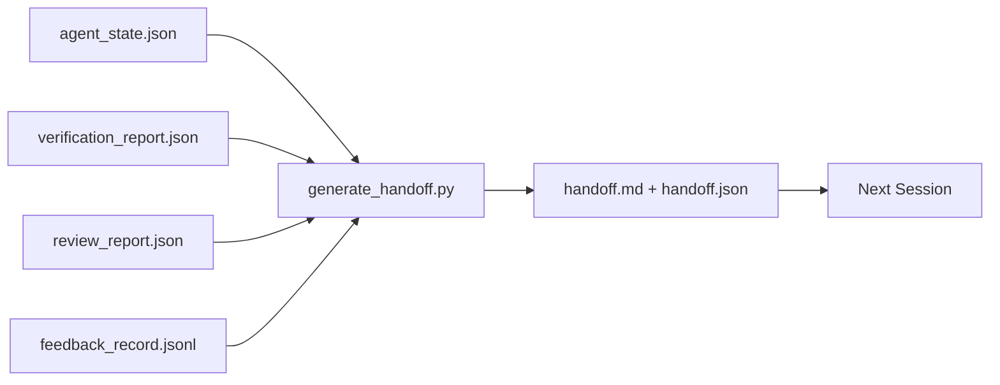

# 跨会话交接（Multi-Session Handoff）

> 会话即将结束，但工作还没有。handoff packet 就是把「agent 工作了一小时」变成「下一个会话在第一分钟就进入状态」的那个产物。要有意地构建它，而不是事后才补。

**Type:** Build
**Languages:** Python (stdlib)
**Prerequisites:** Phase 14 · 34 (Repo Memory), Phase 14 · 38 (Verification), Phase 14 · 39 (Reviewer)
**Time:** ~50 minutes

## 学习目标

- 识别每个 handoff packet 需要的七个字段。
- 从 workbench 产物生成 handoff，无需手写叙述文字。
- 把庞大的 feedback 日志裁剪成 handoff 大小的摘要。
- 让下一个会话的第一个动作是确定性的。

## 问题

会话结束了。agent 说「太好了，我们有进展」。下一个会话打开。下一个 agent 问「我们上次进行到哪儿了？」上一个 agent 的回答已经消失。下一个 agent 重新探索、重新运行同样的命令、重新向人类问同样的问题，烧掉三十分钟来恢复上一个会话最后三十秒的状态。

一次糟糕的 handoff 的成本，在任务存续期间的每一个会话都要支付。解决办法是在会话结束时自动生成一个 packet：改了什么、为什么、试过什么、什么失败了、还剩什么、下次先做什么。

## 概念



### 每个 handoff 携带的七个字段

| 字段 | 它回答的问题 |
|-------|---------------------|
| `summary` | 一段话说明做了什么 |
| `changed_files` | 一眼看清的 diff |
| `commands_run` | 实际执行了什么 |
| `failed_attempts` | 试过什么、为什么没成功 |
| `open_risks` | 下一个会话可能踩到的坑，及其严重程度 |
| `next_action` | 下一个会话采取的第一个具体步骤 |
| `verdict_pointer` | 指向 verification + review 报告的路径 |

`next_action` 字段是最承重的那个。一份除了 `next_action` 什么都有的 handoff，是状态报告，不是 handoff。

### Handoff 是生成的，不是手写的

一份手写的 handoff，就是在艰难的一天里会被跳过的那份 handoff。generator 读取 workbench 产物并输出 packet。agent 的职责是把 workbench 留在一个 generator 能总结的状态，而不是去写总结。

### 两种形式：人类可读与机器可读

`handoff.md` 是给人读的。`handoff.json` 是给下一个 agent 加载的。两者来自相同的源产物。如果它们不一致，以 JSON 为准。

### Feedback 日志裁剪

完整的 `feedback_record.jsonl` 可能有数百条记录。handoff 只携带最后 K 条，加上每一条非零退出码的记录。下一个会话在需要时可以加载完整日志，但 packet 保持小巧。

### 留下干净的状态

一份 handoff 描述工作。一个干净的状态让工作可恢复。它们不是一回事。如果下一个会话打开时面对的是半应用的 diff、一个 agent 忘记的临时文件、一条游离的分支，以及运行前就报错的测试，那么一份完美的 `handoff.md` 一文不值。下一个 agent 于是把前十分钟花在给上一个 agent 收拾残局上，而不是去构建，而这个成本在任务存续期间的每一个会话都会复利累积。

所以会话不是在功能可用的那一刻结束，而是在 workbench 处于「generator 能总结、下一个会话能信任」的状态时结束。清理是它自己的一个阶段，在 handoff 之前运行，而且它是一项检查，不是一个习惯——因为习惯正是在艰难的一天里会被跳过的那个东西。

| 检查项 | 「干净」意味着 | 「脏」会阻塞，因为 |
|-------|-------------|----------------------|
| Working tree | 每一处改动都已提交，或明确 stash 并附说明 | 半应用的 diff 在下一个 agent 眼里像是刻意的改动 |
| Temp artifacts | 不留 `*.tmp`、scratch 目录、调试打印或注释掉的代码块 | 杂散文件污染 diff，也污染下一个 agent 的心智模型 |
| Tests | 全绿，或红色且失败已在 `open_risks` 里点名 | 一个沉默的红色测试是下一个会话会踩进去的陷阱 |
| Feature board | `feature_list.json` 的状态反映现实（Phase 14 · 36） | 陈旧的 board 会把下一个会话派去做已经完成的活 |
| Branch | 在预期的分支上，没有 detached HEAD，没有孤儿分支 | 错误的分支意味着下一个会话的第一个 commit 落到错误的地方 |

清理阶段产出一个 `clean_state.json`，记录阻塞性问题；空列表是 handoff generator 在写出 packet 之前断言的前提条件。建立在脏树上的 handoff 不是 handoff，而是一份被转发出去的烂摊子。这两个产物成对出现：cleanup 证明 workbench 可以放心离开，handoff 证明下一个会话知道从哪里开始。

```figure
wb-handoff-packet
```

## Build It

`code/main.py` 实现了：

- 一个 loader，把 state、verdict、review 和 feedback 汇总进单个 `WorkbenchSnapshot`。
- 一个 `generate_handoff(snapshot) -> (markdown, payload)` 函数。
- 一个过滤器，挑选最后 K 条 feedback 记录，加上所有非零退出码的记录。
- 一个 demo 运行，在脚本旁写出 `handoff.md` 和 `handoff.json`。

运行它：

```
python3 code/main.py
```

输出：打印出的 handoff 正文，加上磁盘上的两个文件。

## 生产实战模式

Codex CLI、Claude Code 和 OpenCode 各自搭载了不同的 compaction 方案；结构化的 handoff packet 位于这三者之上。

**Compaction 策略各不相同；packet 的 schema 不变。** Codex CLI 的 POST /v1/responses/compact 是一个服务端不透明的 AES blob（面向 OpenAI 模型的快速路径）；其回退方案是本地追加的「handoff summary」，作为一条 `_summary` user-role 消息。Claude Code 在上下文达到 95% 时运行五阶段渐进式 compaction。OpenCode 采用基于时间戳的消息隐藏，外加一份五标题的 LLM 摘要。三种不同的机制，同一个需求：把压缩后存活下来的内容序列化成一个可移植的产物。packet 就是这个产物。

**全新会话的 handoff 不是 compaction。** compaction 延长一个会话；handoff 干净地关闭一个会话并开启下一个。Hermes Issue #20372 的论述（2026 年 4 月）是对的：当原地压缩开始退化时，agent 应该写一份精简的 handoff，结束会话，并在全新的上下文中恢复。packet 就是让这次转换变得廉价的东西。错误在于一直压缩到质量崩溃；正确做法是为一早就进行的、干净的 handoff 预留预算。

**每个分支、每个主题一个 active handoff。** 多 agent 协作在过期的 handoff 上崩溃的程度，比在糟糕的模型输出上更严重。始终包含 `branch`、`last_known_good_commit`，以及取值为 `active | superseded | archived` 的 `status`。过期的 handoff 被归档；只有 active 的那份驱动下一个会话。这就是「handoff 作为笔记」与「handoff 作为状态」的区别。

**在 50-75% 上下文处收尾，而不是撞墙时。** 手写模式的 playbook（CLAUDE.md + HANDOVER.md）报告：当会话在 50-75% 上下文预算处（而非 95%）结束时效果最好。packet generator 在压缩产物污染源状态之前干净地运行。上下文完好时写起来便宜；当模型已经开始找不到自己的位置时就很昂贵。

## Use It

生产模式：

- **会话结束钩子。** 当用户关闭聊天时，运行时触发 generator。packet 进入 `outputs/handoff/<session_id>/`。
- **PR 模板。** generator 的 markdown 也是一份 PR 正文。reviewer 无需再打开另外五个文件就能读懂。
- **跨 agent handoff。** 用一个产品（Claude Code）构建，用另一个（Codex）继续。packet 就是通用语。

packet 小巧、规整、制作成本低。节省的成本随每一个会话复利累积。

## Ship It

`outputs/skill-handoff-generator.md` 产出一个针对项目产物路径调优的 generator、一个在会话结束时运行它的钩子，以及一个下一个 agent 在启动时读取的 `handoff.json` schema。

## 练习

1. 加一个 `assumptions_to_validate` 字段，把 builder 记录过、但 reviewer 没有打出 1 分以上的每一条假设暴露出来。
2. 对失败运行和通过运行采用不同的 feedback 摘要裁剪策略。为这种不对称性辩护。
3. 加入一个「向人类提问」的列表。一个问题进入 packet 而不是进入聊天消息的阈值是什么？
4. 让 generator 幂等：运行两次产生相同的 packet。要做到这一点，什么必须保持稳定？
5. 加一个「下一个会话前置条件」小节，精确列出下一个 agent 在动手前必须加载的产物。

## 关键术语

| 术语 | 人们怎么说 | 它实际是什么意思 |
|------|----------------|------------------------|
| Handoff packet | 「会话摘要」 | 携带七个字段的生成产物，同时有 markdown 和 JSON 两种形式 |
| Next action | 「先做什么」 | 开启下一个会话的那一个具体步骤 |
| Feedback trim | 「日志摘要」 | 最后 K 条记录，加上每一条非零退出码 |
| Status report | 「我们做了什么」 | 一份缺少 `next_action` 的文档；有用，但不是 handoff |
| Verdict pointer | 「收据」 | 指向 verification + review 报告的路径，用于追溯 |

## 延伸阅读

- [Anthropic, Effective harnesses for long-running agents](https://www.anthropic.com/engineering/effective-harnesses-for-long-running-agents)
- [OpenAI Agents SDK handoffs](https://openai.github.io/openai-agents-python/handoffs/)
- [Codex Blog, Codex CLI Context Compaction: Architecture, Configuration, Managing Long Sessions](https://codex.danielvaughan.com/2026/03/31/codex-cli-context-compaction-architecture/) — POST /v1/responses/compact 与本地回退
- [Justin3go, Shedding Heavy Memories: Context Compaction in Codex, Claude Code, OpenCode](https://justin3go.com/en/posts/2026/04/09-context-compaction-in-codex-claude-code-and-opencode) — 三家厂商的 compaction 对比
- [JD Hodges, Claude Handoff Prompt: How to Keep Context Across Sessions (2026)](https://www.jdhodges.com/blog/ai-session-handoffs-keep-context-across-conversations/) — CLAUDE.md + HANDOVER.md，50-75% 上下文预算
- [Mervin Praison, Managing Handoffs in Multi-Agent Coding Sessions: Fresh Context Without Losing Continuity](https://mer.vin/2026/04/managing-handoffs-in-multi-agent-coding-sessions-fresh-context-without-losing-continuity/) — 分布式系统视角
- [Hermes Issue #20372 — automatic fresh-session handoff when compression becomes risky](https://github.com/NousResearch/hermes-agent/issues/20372)
- [Hermes Issue #499 — Context Compaction Quality Overhaul](https://github.com/NousResearch/hermes-agent/issues/499) — Codex CLI 中面向 handoff 的提示词
- [Microsoft Agent Framework, Compaction](https://learn.microsoft.com/en-us/agent-framework/agents/conversations/compaction)
- [OpenCode, Context Management and Compaction](https://deepwiki.com/sst/opencode/2.4-context-management-and-compaction)
- [LangChain, Context Engineering for Agents](https://www.langchain.com/blog/context-engineering-for-agents)
- Phase 14 · 34 — generator 读取的 state 文件
- Phase 14 · 38 — packet 指向的 verification verdict
- Phase 14 · 39 — 打包进 packet 的 reviewer 报告