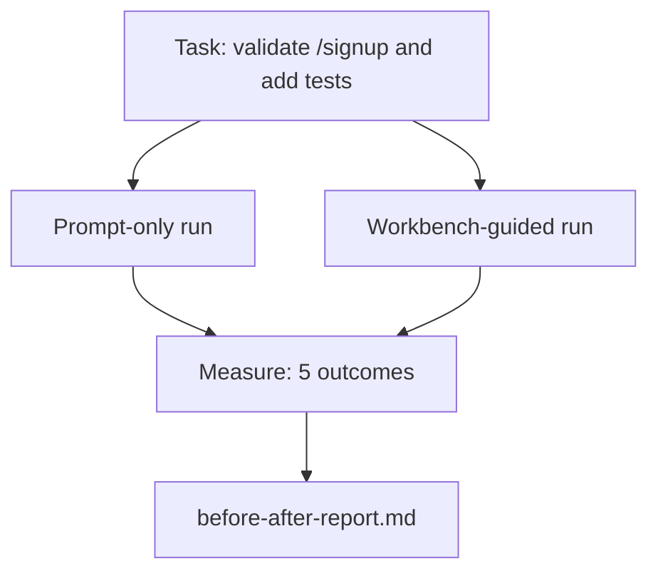

# 在真实仓库上的 Workbench

> 十一个关于 surface 的课时，如果经不起真实代码库的检验，就一文不值。本课在一个小型示例应用上把同一个 task 跑两遍：仅用 prompt 对照 workbench 引导。数字自会说话。

**Type:** Build
**Languages:** Python (stdlib)
**Prerequisites:** Phases 14 · 32 to 14 · 40
**Time:** ~60 minutes

## 学习目标

- 在一个小型应用上把七个 workbench surface 整合到一起。
- 把同一个 task 跑两遍（仅 prompt 与 workbench 引导），并测量五个 outcome。
- 阅读前后对比报告，判断哪些 surface 提供了最大的杠杆。
- 面对「我的模型已经够好了」的质疑，为 workbench 辩护。

## 问题

在玩具任务上的 demo 说服不了任何人。只有当在一个真实感十足的 repo 上的一个真实感十足的任务，以更少的失败、更少的回滚，以及下一个会话能直接使用的 packet 落到生产环境时，workbench 的论据才算成立。

本课交付那个真实感十足的 repo，并让同一个 task 走完两条 pipeline。结果是一份你可以直接递给怀疑者的前后对比报告。

## 概念



### 示例应用

`sample_app/` 中一个极简的 FastAPI 风格 handler：

- `app.py`，包含 `/signup`（还没有校验）。
- `test_app.py`，只有一个 happy-path 测试。
- `README.md` 和 `scripts/release.sh` 作为禁区诱饵。

### 任务

> 给 `/signup` 加上输入校验：拒绝长度不足 8 个字符的密码，返回带类型化错误信封的 422。加一个能证明新行为的测试。

### 两条 pipeline

仅 prompt：

1. 读 README。
2. 读 `app.py`。
3. 编辑文件。
4. 声称完成。

Workbench 引导：

1. 运行 init 脚本（第 35 课）。
2. 读 scope contract（第 36 课）。
3. 读 state（第 34 课）。
4. 只编辑允许的文件。
5. 通过 feedback runner 运行验收命令（第 37 课）。
6. 运行 verification gate（第 38 课）。
7. 运行 reviewer（第 39 课）。
8. 生成 handoff（第 40 课）。

### 测量的五个 outcome

| Outcome | 为什么重要 |
|---------|----------------|
| `tests_actually_run` | 大多数「测试通过」的说法都无法验证 |
| `acceptance_met` | 证明目标的测试必须就是实际运行的那个测试 |
| `files_outside_scope` | scope 蔓延是最主要的无声失败 |
| `handoff_quality` | 下一个会话为它付出代价，或从中受益 |
| `reviewer_total` | 在 gate 之上的定性判断 |

```figure
wb-ab-runs
```

## Build It

`code/main.py` 针对同一个示例应用 fixture 编排两条 pipeline。两条 pipeline 都是脚本化的（回路里没有 LLM），因此测量是可复现的。脚本把对比写入 `before-after-report.md` 和 `comparison.json`。

运行：

```
python3 code/main.py
```

输出：每条 pipeline 各 outcome 的控制台表格、保存在脚本旁的 markdown 报告，以及给任何想画图的人的 JSON。

## 生产实战模式

怀疑者的问题是「workbench 到底有多大帮助？」2026 年的数字比解释更有说服力。

**同一个模型，Terminal Bench 从 30 名开外跃升至第 5 名。** LangChain 的 *Anatomy of an Agent Harness*（2026 年 4 月）：一个 coding agent 仅靠改动 harness，就从 Terminal Bench 2.0 的 30 名开外跃升至第 5 名。同一个模型，不同的 surface。25 个名次的差距。

**Vercel 通过删除工具从 80% 提升到 100%。** Vercel 报告称，删除其 agent 80% 的工具后，成功率从 80% 提升到 100%。更小的工具 surface、更清晰的 scope、更少的失败方式。留白制胜。

**Harvey 仅靠 harness 就让准确率翻倍。** 法律 agent 通过 harness 优化将准确率提升了一倍以上，没有更换模型。

**88% 的企业 AI agent 项目未能进入生产。** preprints.org 的 *Harness Engineering for Language Agents* 论文（2026 年 3 月）把这些失败追溯到 runtime 而非推理：陈旧的 state、脆弱的重试、过度膨胀的上下文、对中间错误的恢复不力。

**长上下文崩溃。** WebAgent 基线 40-50% 的成功率在长上下文条件下跌到 10% 以下，主要原因是无限循环和目标丢失。Ralph Loop 和 handoff packet 的存在正是为了吸收这一点。

**假阴性依然存在。** 单步事实性任务、单行 lint、formatter 运行、任何模型已逐字记住的东西——这些仅用 prompt 跑得更快。基准测试应该诚实地把它们列举出来，以免把 workbench 说成是小题大做。

结论不是「harness 永远赢」。模型确实会随着时间吸收 harness 的技巧。结论是：当下，工程的重担落在七个 surface 上，数字证明了这一点。

## Use It

在以下情形，本课就是你引用的案卷：

- 有人问为什么每个 PR 都带着一个 `agent-rules.md` 和一个 scope contract。
- 有团队想「就这一个 sprint」砍掉 verification gate。
- 一个新的 agent 产品上线了，你需要一个可移植的基准来判断它是否真的省时间。

数字比解释传得更远。

## Ship It

`outputs/skill-workbench-benchmark.md` 是一个可移植的评估 harness，它让任何 agent 产品针对项目自己的示例应用跑完两条 pipeline，并报告五个 outcome。

## 练习

1. 加一个第六 outcome：从开始到第一次有意义的编辑所需的时间。如何干净地测量它？
2. 在你代码库里的一个真实的第二天任务上运行对比。workbench 的数字在哪里滑坡？
3. 加一轮「假阴性」：那些仅用 prompt 会更快、workbench 的开销是真实成本的任务。为无论如何都要保留 workbench 辩护。
4. 把脚本化的「agent」替换成一次真实的 LLM 调用。哪些 outcome 会变得更吵？
5. 写一份面向非工程师的一页摘要。什么东西能通过删减？

## 关键术语

| 术语 | 人们怎么说 | 它实际是什么意思 |
|------|----------------|------------------------|
| Sample app | 「玩具仓库」 | 小但足够真实，能锻炼全部七个 surface |
| Pipeline | 「工作流」 | agent 遵循的、有序的 surface 读写序列 |
| Before/after report | 「收据」 | 你递给怀疑者的那个产物 |
| False negative | 「workbench 小题大做」 | 仅用 prompt 更快的任务；值得诚实地列举 |
| Workbench benchmark | 「可靠性评分」 | 在你的代码库上运行对比的可移植 harness |

## 延伸阅读

- [LangChain, The Anatomy of an Agent Harness](https://blog.langchain.com/the-anatomy-of-an-agent-harness/) — Terminal Bench 从 30 名开外跃升至第 5 名的收据
- [MongoDB, The Agent Harness: Why the LLM Is the Smallest Part of Your Agent System](https://www.mongodb.com/company/blog/technical/agent-harness-why-llm-is-smallest-part-of-your-agent-system) — Vercel + Harvey 的数字
- [preprints.org, Harness Engineering for Language Agents](https://www.preprints.org/manuscript/202603.1756) — 88% 的企业失败率，runtime 层面的根因
- [HN: Improving 15 LLMs at Coding in One Afternoon. Only the Harness Changed](https://news.ycombinator.com/item?id=46988596) — 在 15 个模型上复现
- [Cloudflare, Orchestrating AI Code Review at Scale](https://blog.cloudflare.com/ai-code-review/) — 30 天 13.1 万次 review 运行，已在生产
- [Anthropic, Building Effective Agents](https://www.anthropic.com/research/building-effective-agents)
- Phases 14 · 32 到 14 · 40 — 本课端到端锻炼的这些 surface
- Phase 14 · 19 — 作为本课补充的宏观基准 SWE-bench、GAIA、AgentBench
- Phase 14 · 30 — 同一 harness 接入的 eval 驱动的 agent 开发
