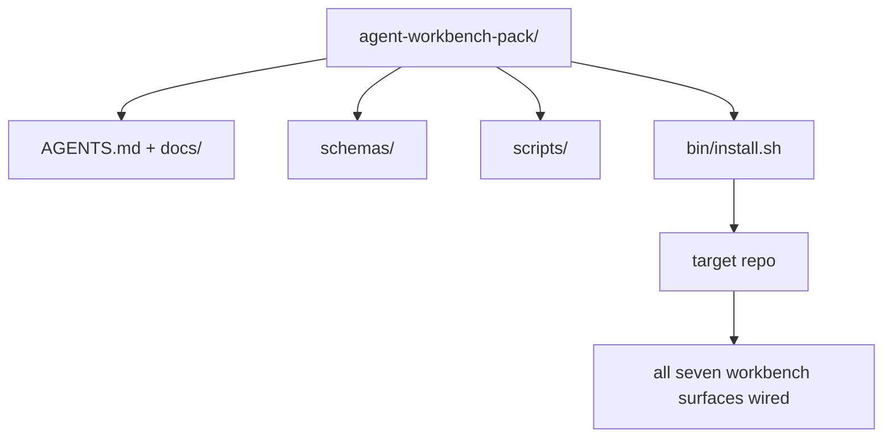

# Capstone：交付一个可复用的 Agent Workbench Pack

> 这个小轨道以一个可以丢进任何 repo 的 pack 收尾。十一课时的 surface 被压缩进一个目录，你 `cp -r` 一下，第二天早上就有一个稳定工作的 agent。capstone 是本课程赖以交换的产物。

**Type:** Build
**Languages:** Python (stdlib)
**Prerequisites:** Phases 14 · 31 to 14 · 41
**Time:** ~75 minutes

## 学习目标

- 把七个 workbench surface 打包进一个即插即用的目录。
- 钉住 schema、脚本和模板，让新 repo 获得一个已知良好的基线。
- 加一个单一的安装脚本，幂等地铺设这个 pack。
- 决定什么留在 pack 里、什么留在外面，并为每一处取舍辩护。

## 问题

一个散落在 Google Doc、聊天记录和三个半记得的脚本里的 workbench，就是一个每个季度都要重建的 workbench。解药是一个带版本号的 pack：一个包含 surface、schema、脚本和一个一条命令安装器的 repo 或目录。

本课结束时，你会在磁盘上交付 `outputs/agent-workbench-pack/`，以及一个能把它丢进任何目标 repo 的 `bin/install.sh`。

## 概念



### pack 布局

```
outputs/agent-workbench-pack/
├── AGENTS.md
├── docs/
│   ├── agent-rules.md
│   ├── reliability-policy.md
│   ├── handoff-protocol.md
│   └── reviewer-rubric.md
├── schemas/
│   ├── agent_state.schema.json
│   ├── task_board.schema.json
│   └── scope_contract.schema.json
├── scripts/
│   ├── init_agent.py
│   ├── run_with_feedback.py
│   ├── verify_agent.py
│   └── generate_handoff.py
├── bin/
│   └── install.sh
└── README.md
```

### 什么留下，什么出局

留下：

- Surface schema。它们是 contract。
- 上面的四个脚本。它们是 runtime。
- 四份文档。它们是规则和 rubric。

出局：

- 项目特定的 task。task 属于目标 repo 的 board，不属于 pack。
- 厂商 SDK 调用。pack 与框架无关。
- 入职文章。pack 与团队现有的入职材料并排放置，而不是塞进其中。

### 安装器

一个简短的 `bin/install.sh`（或 `bin/install.py`）：

1. 在没有 `--force` 的情况下，拒绝覆盖已存在的 pack。
2. 把 pack 复制进目标 repo。
3. 如果存在 `.github/workflows/`，就接好 CI。
4. 打印接下来的步骤：填写 board、设定验收命令、运行 init 脚本。

### 版本管理

pack 携带一个 `VERSION` 文件。需要迁移的 schema 升级和脚本改动递增主版本号。只改文档的变更递增补丁版本号。目标 repo 的 `agent_state.json` 记录它是针对哪个 pack 版本初始化的。

```figure
wb-pack-install
```

## Build It

`code/main.py` 把 pack 组装进课旁的 `outputs/agent-workbench-pack/`，用这个小轨道前面几课的 schema 和脚本、以及你已经写的文档做种子。

运行：

```
python3 code/main.py
```

脚本复制并钉住这些 surface，写 README，打印 pack 树，然后以零退出码结束。重复运行是幂等的。

## 生产实战模式

一个 pack 只有在经得起 fork、更新和一个不友好的上游时才有价值。四个模式让这成为可能。

**`VERSION` 是 contract，不是营销。** 主版本升级需要 state 迁移。次版本升级需要重新跑一遍 checker。补丁升级只改文档。安装器每次安装都把 `.workbench-version` 写进目标 repo；如果目标的锁与 pack 的 `VERSION` 不一致，`lint_pack.py` 就拒绝交付。这就是 `npm`、`Cargo` 和 `pyproject.toml` 能经受十年折腾的方式；关于 agent 的东西并不会改变这些规则。

**跨工具分发的单一来源。** Nx 交付一个 `nx ai-setup`，从一份配置铺设 `AGENTS.md`、`CLAUDE.md`、`.cursor/rules/`、`.github/copilot-instructions.md` 和一个 MCP server。pack 应该做同样的事；安装器产出符号链接（`ln -s AGENTS.md CLAUDE.md`），让单一事实来源扇出给每一个 coding agent。为了让一个工具压过另一个工具而 fork pack，是一种失败模式。

**在有实质 state 时拒绝执行的 `uninstall.sh`。** 卸载 pack 不得删除用户的 `agent_state.json`、`task_board.json` 或 `outputs/`。卸载器移除 schema、脚本、文档和 `AGENTS.md`（可用 `--keep-agents-md` 退出），并且当 state 文件有任何未提交的改动时就拒绝继续。state 属于用户；pack 并不拥有它。

**Skill 作为可发布物。SkillKit 风格的分发。** pack 以 SkillKit skill 形式交付：`skillkit install agent-workbench-pack` 从单一来源把它铺到 32 个 AI agent 上。pack repo 是事实来源；SkillKit 是分发渠道。厂商锁定瓦解；七个 surface 保持不变。

## Use It

pack 交付到三个地方：

- **作为一个你可以丢进 repo 的目录。** `cp -r outputs/agent-workbench-pack /path/to/repo`。
- **作为一个公开的模板 repo。** fork 然后定制，用 `VERSION` 控制漂移。
- **作为一个 SkillKit skill。** 接入你的 agent 产品，让一条命令就把它铺好。

pack 是配方。每一次安装就是一份出品。

## Ship It

`outputs/skill-workbench-pack.md` 生成一个项目调优的 pack：规则针对团队历史打磨，scope glob 匹配 repo，rubric 维度扩展一条领域特定的条目。

## 练习

1. 决定哪一份可选的第五文档值得晋升进规范 pack。为这一取舍辩护。
2. 把安装器改写为带 `--dry-run` 标志的 Python。与 bash 对比一下易用性。
3. 加一个 `bin/uninstall.sh`，安全移除 pack，并在 state 文件有实质历史时拒绝执行。什么算作「实质」？
4. 加一个 `lint_pack.py`，当 pack 偏离 `VERSION` 时就失败。把它接入 pack 自己 repo 的 CI。
5. 写一份从手工搭建的 workbench 迁移到这个 pack 的 runbook。什么操作顺序能把停机时间降到最低？

## 关键术语

| 术语 | 人们怎么说 | 它实际是什么意思 |
|------|----------------|------------------------|
| Workbench pack | 「新手套件」 | 一个携带全部七个 surface 的、带版本号的目录 |
| Installer | 「安装脚本」 | 幂等地铺设 pack 的 `bin/install.sh` |
| Pack version | 「VERSION」 | schema/脚本改动递增主版本号，只改文档递增补丁号 |
| Drop-in pack | 「cp -r 就走」 | 第一天无需按 repo 定制就能工作的 pack |
| Forkable template | 「GitHub 模板」 | GitHub 的「Use this template」能从中克隆的公开 repo |

## 延伸阅读

- Phases 14 · 31 到 14 · 41 — 这个 pack 捆绑的每一个 surface
- [SkillKit](https://github.com/rohitg00/skillkit) — 把这个 skill 安装到 32 个 AI agent 上
- [Nx Blog, Teach Your AI Agent How to Work in a Monorepo](https://nx.dev/blog/nx-ai-agent-skills) — 覆盖六个工具的单一来源生成器
- [agents.md — the open spec](https://agents.md/) — 你的 pack 的 router 必须实现什么
- [HKUDS/OpenHarness](https://github.com/HKUDS/OpenHarness) — pack 等价物的参考实现
- [Augment Code, A good AGENTS.md is a model upgrade](https://www.augmentcode.com/blog/how-to-write-good-agents-dot-md-files) — pack 文档的质量基准
- [Anthropic, Effective harnesses for long-running agents](https://www.anthropic.com/engineering/effective-harnesses-for-long-running-agents)
- [Anthropic, Harness design for long-running application development](https://www.anthropic.com/engineering/harness-design-long-running-apps)
- Phase 14 · 30 — 消费 pack 的 verification gate 的 eval 驱动 agent 开发
- Phase 14 · 41 — 这个 pack 所改进的前后对比基准