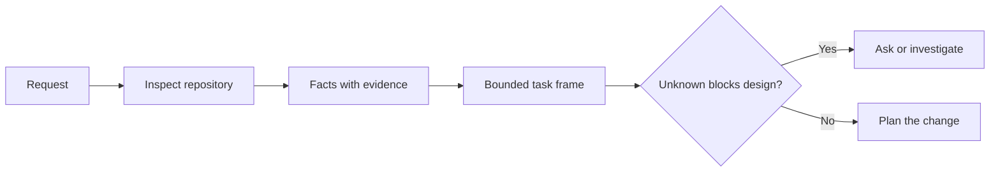

# 在 Agent 写代码之前先框定任务

> 一个 coding agent 可以快速实现一个清晰的任务。它也可以快速实现一个不清晰的任务。速度一样。代价不一样。

**Type:** Learn + Build
**Languages:** Python (stdlib)
**Prerequisites:** Phase 14 lessons 31 and 36
**Time:** ~60 minutes

## 学习目标

- 在动手编辑之前，把一个请求转成一个有边界的 task frame。
- 把仓库事实与假设和未决问题区分开。
- 定义允许路径、禁止路径和验收证据。
- 判断何时侦查已经足够，可以开始工作。

## 代价高昂的失败

「加一个重复邮箱保护」听起来很具体。其实不然。唯一性应该落在 API、领域服务还是数据库里？比较是否区分大小写？哪个错误形态已经对外公开？是否允许迁移？哪个测试能证明这个行为？

一个有能力的 agent 会用看似合理的选择来填补这些空白。这才是危险的情况，因为实现可以是干净的、有测试的，却仍然与系统不兼容。

因此，coding-agent 工作的第一个单元不是一次编辑，而是一个有仓库证据支撑的 task frame。

## Task Frame

一个有用的 frame 有六个字段：

| 字段 | 问题 |
|---|---|
| Goal | 什么可观察的行为必须改变？ |
| Repository facts | 你在代码、测试、配置或历史里核实了什么？ |
| Allowed paths | 改动可以落在哪里？ |
| Forbidden paths | 什么必须保持不动？ |
| Acceptance evidence | 哪些命令或观察能证明目标达成？ |
| Unknowns | 哪些决策仍需要证据或人的判断？ |

事实需要收据。「API 用 409 表示重复」在你指向现有的测试或 handler 之前，还不是事实。一个文件路径加行号就够了。当行为至关重要时，一个命令的结果更好。



## 侦查是对约束的搜索

不要通读整个仓库。去搜索那些约束这次改动的 surface：

1. 当前行为及其调用方。
2. 最接近的现有测试。
3. 公开的 contract 或序列化形态。
4. 管辖该路径的项目指令。
5. 构建和验证命令。
6. 揭示本地模式的、相似的已完成改动。

当每一个计划中的决策要么有证据支撑、要么被明确委托、要么被列为 unknown 时，就停下。在那之后继续读，往往是一种逃避。

## Unknown 不是失败

一个 unknown 是一个受控的缺口。一个 assumption 是对那个缺口的失控回答。

对每个 unknown 分类：

- **Discoverable（可发现的）：** 仓库或运行中的系统能回答它。
- **Decidable（可决策的）：** task contract 赋予 agent 选择权。
- **Human（需要人的）：** 这个选择会改变产品行为、成本、风险或公开兼容性。
- **Deferred（延迟的）：** 这个选择在本切片之外，属于非目标。

agent 应该穿过可发现的和被委托的 unknown。它应该在 human unknown 处停下，以免这个选择被埋进代码。

## 先验收，后实现

在写 patch 之前先写 proof。proof 可以是：

- 一个聚焦的单元或集成测试命令；
- 一次带命名视口和预期状态的浏览器旅程；
- 一个 wire 请求和精确的响应 contract；
- 一个带阈值的性能测量；
- 一次确认没有无关文件被改动的 scope 检查。

「测试通过」不是一个 proof 计划。要指名那个权威测试，以及它所支撑的断言。

## Build It

实验创建一个 `TaskFrame`，校验它的边界和证据，并写出 `outputs/task-frame.md`。

从本课目录运行：

```bash
python3 code/main.py
python3 -m unittest discover code/tests -v
```

用四种方式破坏示例：去掉 goal、去掉一个事实收据、让一个允许路径和禁止路径重叠、去掉验收命令。校验器应该为每一种 frame 用不同的理由拒绝它。

## 在真实仓库中使用

在让 agent 动手编辑之前：

1. 把 goal 写成一个行为，而不是一次文件改动。
2. 记录两到三条带精确证据的事实。
3. 命名最小的允许路径集合。
4. 明确地命名留白（negative space）。
5. 写下关闭这个 task 的命令或观察。
6. 列出你还没有挣到的那些决策。

frame 应该一屏装得下。如果装不下，这个 task 可能包含多个可独立验证的改动。

## 练习

1. 从你的一个仓库里挑一个真实的 bug，不提出解决方案，只做一个 frame。
2. 在 frame 里找出一条其实是 assumption 的断言。用证据替换它。
3. 加一个 human unknown，它的答案会改变公开 contract。
4. 把一条宽泛的允许路径拆成最小的安全集合。
5. 在验收证据里加一条 scope 收据。

## 延伸阅读

- [Nuseibeh and Easterbrook, Requirements Engineering: A Roadmap](https://www.cs.toronto.edu/~sme/papers/2000/ICSE2000.pdf)，用于把实现锚定到现实世界的目标和不断演进的约束。
- [Yang et al., SWE-agent: Agent-Computer Interfaces Enable Automated Software Engineering](https://arxiv.org/abs/2405.15793)，用于证明 coding agent 周围的界面会改变其有效性。

## 你会留下什么

保留 `outputs/task-frame.md`。它是下一课的输入，在那里，frame 会变成一个 evidence-backed 的执行 plan。