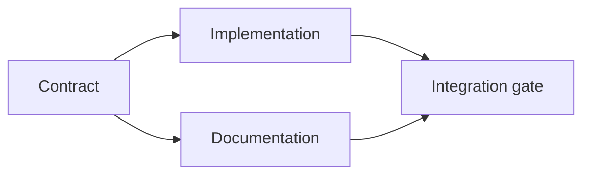

# 构建一个 Evidence-Backed 的执行 Plan

> 一个 plan 不是一份更好看的待办清单。它是一张依赖图，其中每一个改动都有理由，每一个终节点都有 proof。

**Type:** Learn + Build
**Languages:** Python (stdlib)
**Prerequisites:** Phase 14 lesson 43
**Time:** ~65 minutes

## 学习目标

- 把一个 task frame 转成带证据和 proof 的工作项。
- 把顺序建模为依赖，而不是散文式的序列。
- 在编辑之前检测缺失的事实、未知的依赖和环。
- 把可以并行运行的步骤与必须等待的步骤分开。

## 为什么 Agent 的 Plan 会失败

弱 plan 用将来时把请求重复一遍：

1. 更新 API。
2. 加测试。
3. 更新文档。

那个列表里没有一句说：发现了什么、为什么那些文件是对的、哪个 contract 先改、什么可以并发。agent 可以照做每一步，却仍然制造返工。

一个强 plan 为每个工作项做出五项承诺：

| 承诺 | 作用 |
|---|---|
| Identifier | 供依赖和 handoff 使用的稳定引用 |
| Change | 最小的行为或 contract 变更 |
| Evidence | 证明该改动合理的仓库事实 |
| Dependencies | 必须先行成立的工作 |
| Proof | 关闭该项的确切检查 |

## 在实现之前先规划 Contract

当多个 surface 依赖同一个行为时，先定义行为。然后测试、实现、文档和集成就能共享一个 contract，而不是各自发明四个版本。



这张图暴露了安全的并发。contract 定下来之后，实现和文档可以一起推进。集成等待两者。

## 证据会改变 Plan

仓库证据不是装饰。它应该能改变工作本身：

- 一个已有的 helper 取消了一个计划中的新抽象。
- 一个兼容性测试强制出一次迁移步骤。
- 一条部署约束把一次 schema 变更挪到另一个 task。
- 一个公开的响应类型改变了实现和文档的顺序。

如果证据无法改变 plan，那它很可能根本不是针对那个决策的证据。

## 为中断而设计

coding-agent 的会话会意外结束。一个可恢复的 plan，其工作项要小到让另一个会话能判断出：

- 哪一项已完成；
- 哪个 proof 运行过；
- 哪些产物改变了；
- 哪些依赖现已解除阻塞；
- 下一个安全的项是什么。

不要把 state 只编码进聊天里勾选的方框。把 plan 存放在工作旁边。

## Plan 校验

在执行之前，当出现以下情况时拒绝这个 plan：

- 有重复的 identifier；
- 某个工作项没有证据；
- 某个工作项没有 proof；
- 某个依赖指向一个未知的项；
- 图中含有一个环；
- 第一个不可逆动作发生在相关不确定性被解决之前。

前五项检查是机械的。最后一项需要判断，应当被明确地指出来。

## Build It

`code/main.py` 建模工作项，校验它们的收据，用拓扑排序计算执行波次，并写出 `outputs/evidence-plan.json`。

运行：

```bash
python3 code/main.py
python3 -m unittest discover code/tests -v
```

示例产生三个波次。contract 定义先跑。实现和文档一起跑。integration gate 最后跑。

## 与 Coding Agent 一起使用

让 agent 在改动文件之前先产出 plan。审查 plan 时看三点：

1. 每一条路径和行为断言都有一条仓库收据。
2. 每一项都有且只有一个清晰的完成 proof。
3. 图会把昂贵或不可逆的工作推迟到它所依赖的不确定性被解决之后。

批准的是 plan，而不是一句含糊的「我会小心」的承诺。

## 练习

1. 加一个需要明确人工批准的迁移项。
2. 造一个环，并解释它背后的隐性产品分歧。
3. 拆开一个有两条 proof 命令的项。
4. 加一个能在第二波运行、又不碰任何既有分支的工作项。
5. 在保持 JSON 作为事实来源的同时，把 plan 渲染为 Markdown。

## 延伸阅读

- [Nuseibeh and Easterbrook, Requirements Engineering: A Roadmap](https://www.cs.toronto.edu/~sme/papers/2000/ICSE2000.pdf)，用于目标、规格说明、共识与演进之间的迭代关系。
- [Barry Boehm, A Spiral Model of Software Development and Enhancement](https://dl.acm.org/doi/10.1145/12944.12948)，用于围绕风险消解、而非固定线性序列来安排开发顺序。

## 你会留下什么

保留 `outputs/evidence-plan.json`。它成为下一课的 delegation contract。