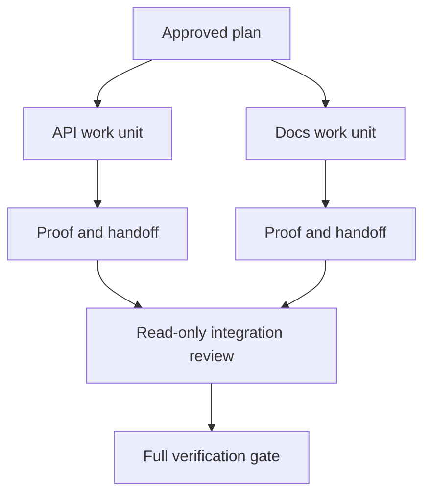

# 用隔离和合并 Contract 来委派 Agent 工作

> 并行 agent 只有在工作相互独立时才省墙钟时间。否则，它们把一个清晰的任务变成一个失败率更高的协调问题。

**Type:** Learn + Build
**Languages:** Python (stdlib)
**Prerequisites:** Phase 14 lessons 39 and 44
**Time:** ~70 minutes

## 学习目标

- 判断 delegation 是否由真实的独立性所证成。
- 给每个 worker 排他的文件所有权和明确的 proof。
- 从依赖计算出执行波次。
- 设计一个用于安全合并 agent 工作的 merge contract。

## 并行性测试

不要因为有更多 agent 可用就委派。当以下至少一条成立时才委派：

- 两个调查能各自独立地回答不同的 unknown；
- 两个实现拥有不相交的文件和 contract；
- 一个 reviewer 能在不改变已完成产物的情况下检查它；
- 一个缓慢的外部检查能在本地工作继续进行时运行。

当 agent 需要相同的文件、相同的未决决策、或相同的可变环境时，就让工作保持串行。

## 一个工作单元就是一个 Contract

每个被委派的单元都需要：

| 字段 | 含义 |
|---|---|
| Goal | 一个可观察的结果 |
| Owner | 一个负责的 worker |
| Paths | 排他的写所有权 |
| Dependencies | 开始前必须已完成的单元 |
| Proof | 返回给 integrator 的确切证据 |
| Handoff | 改动的文件、做出的决策、剩余的风险 |

「把后端处理掉」不是一个工作单元。「在 `app/accounts.py` 里实现重复检查，并用聚焦的账户测试证明它」才是。

## 隔离有三个层次

1. **文件系统隔离：** 分开的 worktree 或沙箱防止意外的共享编辑。
2. **所有权隔离：** contract 防止两个 worker 有意编辑同一条路径。
3. **State 隔离：** 分开的日志和输出防止一个 worker 覆盖另一个 worker 的证据。

文件系统隔离解决不了所有权问题。两个干净的 worktree 仍然可能产出相互冲突的设计。merge contract 必须在工作开始之前就解决共享接口。



## Integrator 不重做工作

integrator 应该：

1. 确认每份 handoff 与其分配的 scope 相符；
2. 读 proof 的输出，而不只是 worker 的摘要；
3. 按依赖顺序合并改动；
4. 运行完整的跨单元 gate；
5. 拒绝隐藏的 scope 扩张；
6. 把冲突记录为新的决策，而不是无声的编辑。

如果集成需要重写一个 worker 的大部分成果，那最初的分解就是错的。

## 人与 Agent 的角色

delegation 并不移除人的判断。人仍然拥有那些会改变公开行为、风险、权限或不可逆成本的决策。agent 可以拥有有边界的调查、实现、验证和 review。

这就是校准后的自主性：在证据和回滚都强的地方，系统给予自由；在后果严重的地方，系统要求一个检查点。

## Build It

实验检查路径重叠、校验依赖、计算安全的执行波次，并写出 `outputs/delegation-plan.json`。

运行：

```bash
python3 code/main.py
python3 -m unittest discover code/tests -v
```

把 docs 单元改成拥有 `app/`。plan 应当被阻塞，因为那个父路径与 API 单元重叠。

## 练习

1. 把一个真实的改动分解成两个独立的工作单元和一个 integrator。
2. 找出一个只是看起来独立的并行拆分。说出那个共享的决策。
3. 加一个只读的研究 worker，其输出是一张事实表。
4. 加一个 merge gate，用所有单元 contract 检查最终的改动文件集合。
5. 为一个依赖失效的 worker 定义一条取消规则。

## 延伸阅读

- [Reid Smith, The Contract Net Protocol](https://doi.org/10.1109/TC.1980.1675516)，用于分布式任务分配与结果上报的早期形式化处理。
- [Eric Horvitz, Principles of Mixed-Initiative User Interfaces](https://dl.acm.org/doi/10.1145/302979.303030)，用于决定自动化何时行动、何时把控制交还给一个人。

## 你会留下什么

保留 `outputs/delegation-plan.json`。它记录了这个拆分为什么安全、谁拥有每条路径，以及集成必须收到什么 proof。