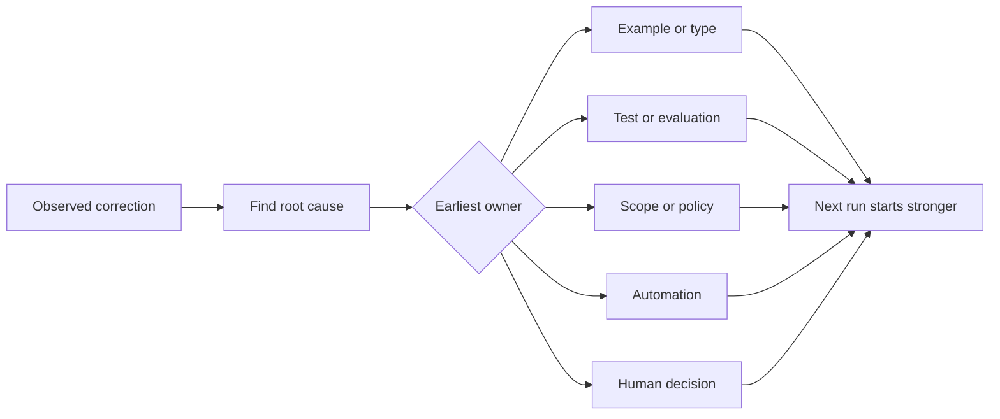

# 把每一次智能体纠正转化为系统改进

> 只停留在聊天里的纠正只能修好一次运行。被提升为测试、边界、示例或工具的纠正，会改进之后的每一次运行。

**Type:** Learn + Build
**Languages:** Python (stdlib)
**Prerequisites:** Phase 14 · 第 37–41 课
**Time:** ~65 minutes

## 学习目标

- 将智能体纠正转化为持久的控制。
- 把每项控制放到能最早阻止复发的那一层。
- 用稳定的指纹对重复的教训去重。
- 退役那些不再防护真实风险的控制。

## 纠正是证据

当你告诉智能体「不要编辑那个文件」时，你已经认识到范围边界并不是可执行的。当你说「这个输出形态不对」时，你已经认识到缺少了某个示例或测试。当 setup 再次失败时，你已经认识到环境知识应当放进自动化里。

把纠正当作对工作系统的观察，而不是一次写提示词的失败。

## 提升到最早有效的那一层

按这个顺序：

| 反复出现的故障 | 持久的目的地 |
|---|---|
| 结果错误或回归 | 测试或评估 |
| 越界或不安全的动作 | 范围或权限策略 |
| 反复出现的 setup 或命令错误 | 自动化或工具 |
| 反复出现的输出格式错误 | 规范示例加校验器 |
| 含糊的本地约定 | 带场景检查的指令 |
| 产品分歧 | 人类决策记录 |

越早的控制越廉价。一个能阻止非法状态的类型，比事后才发现它的评审意见更强。一个聚焦的测试，比一段要求智能体记住的段落更强。



## 棘轮记录

记录：

- 症状；
- 根本原因；
- 后果；
- 复发次数；
- 选定的控制；
- 针对该控制的验证；
- 负责人；
- 复审或退役的日期。

不要提升每一个一次性的偏好。只有当复发或后果值得引入永久复杂度时，才提升一项纠正。

## 把原因与症状分开

「智能体编辑了 README」是症状。可能的原因包括：

- 任务允许访问仓库根目录；
- 文档被默认视为安全；
- 计划把实现和文档捆绑在了一起；
- 两个 worker 的归属相互重叠。

每个原因对应不同的控制。一条只是复述症状的规则，会在下一次稍有不同的事件中失效。

## 控制也会衰减

旧的控制会相互冲突、膨胀上下文，并固化一个已不存在的系统。每条被提升的规则都需要一次退役检查。在以下情况删除或重写它：

- 底层架构发生了变化；
- 更强大的可执行控制取代了它；
- 故障在一个有意义的时间窗口内没有再复发；
- 该控制带来的摩擦超过了它所要防范的风险。

目标不是最长的指令文件，而是能保住来之不易判断的最小系统。

## Build It

这个实验对纠正进行分类，把它们提升为控制，对重复项打指纹，并写出 `outputs/feedback-ratchet.json`。

运行：

```bash
python3 code/main.py
python3 -m unittest discover code/tests -v
```

添加两条措辞不同但原因相同的纠正。改进归一化，直到它们合并为一条控制，而不会把无关的故障也合并进来。

## 练习

1. 从最近一次编码会话中取五条纠正，给它们真实的负责人分类。
2. 把一条散文式的规则替换为可执行测试。
3. 加入后果权重，让严重的首次发生也能立即被提升。
4. 给实验输出加上负责人和退役日期。
5. 复审一条现有的智能体指令，只有在证明存在更强控制后才删除它。

## 延伸阅读

- [Basili、Caldiera 和 Rombach，The Goal Question Metric Approach](https://www.cs.toronto.edu/~sme/CSC444F/handouts/GQM-paper.pdf)，用于把目标转化为问题和可操作的度量。
- [Shinn 等人，Reflexion](https://arxiv.org/abs/2303.11366)，用于在不改变模型权重的情况下，利用反馈轨迹改进后续决策。
- [Madaan 等人，Self-Refine](https://arxiv.org/abs/2303.17651)，用于任务循环内的迭代反馈和修订。

## 你保留的成果

保留 `outputs/feedback-ratchet.json`。它是 Agent-Assisted Engineering 路径的持久终点，也是未来 workbench 改动的输入。
