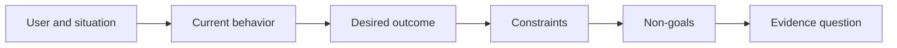

# 在选择输出之前先定义成果

> 快速的实现放大了选错问题的代价。先塑造成果，让速度指向正确的方向。

**Type:** Learn + Build
**Languages:** Python (stdlib)
**Prerequisites:** 无
**Time:** ~60 minutes

## 学习目标

- 写一个不点名任何方案的成果框架。
- 识别用户、情境、当前行为和期望的改变。
- 把约束和非目标明确写出来。
- 在方案泄漏固化为范围之前就发现它。

## 输出不是成果

「构建一个事故助手」说的是一个输出。它没有说明谁需要它、什么会变得更好，或什么必须保持安全。

一个成果框架会这么说：

> 当生产告警到达时，值班工程师在两分钟内识别出故障服务以及一个安全的下一步行动，同时诊断保持只读且可审计。

这句话可以由软件、一份 runbook、一次数据修复，或一个更小的界面改动来满足。它让团队锚定在结果上，而不是某人最早想象出来的那个产物上。

## 六部分框架

| 部分 | 问题 |
|---|---|
| 用户 | 谁直接经历这个问题？ |
| 情境 | 它何时何地发生？ |
| 当前行为 | 今天发生了什么，包括各种变通办法？ |
| 期望成果 | 哪个可观察的状态应当改善？ |
| 约束 | 哪些安全、策略、成本或兼容性限制是固定的？ |
| 非目标 | 哪些诱人的邻近工作被排除在外？ |



## 找出方案泄漏

当成果陈述包含尚未被证据证明的产品形态、界面、模型选择、框架或架构时，它就泄漏了方案。

- 「用户每周收到一份 AI 摘要」泄漏了摘要和频率。
- 「用户在批准前理解账户变更」陈述的是结果。
- 「部署一个向量数据库」泄漏了基础设施。
- 「相关策略证据在评审期间可用」陈述的是一种能力。

当兼容性确实锁定了某种技术时，约束可以点明该技术。要记录它为什么是固定的。

## 约束保护成果

约束不是实现细节，它们是现实目标的一部分：

- 诊断期间不产生生产写入；
- 在事故时间预算内响应；
- 现有审计事件仍然是权威的；
- 不引入新的运行时依赖；
- 无障碍行为保持不变。

一个靠违反约束才达到成果的构建，实际上并没有达到成果。

## 非目标划定边界

非目标阻止一个有用的切片膨胀成平台。好的非目标要足够具体，以至于能据以拒绝工作：

- 不做自动修复；
- 不新建告警路由系统；
- 不替换事故指挥官；
- 这个切片里不做历史分析。

## Build It

这个实验校验一个 `OutcomeFrame` 并写出 `outputs/outcome-frame.json`。

```bash
python3 code/main.py
python3 -m unittest discover code/tests -v
```

把期望成果替换成「使用事故助手」。校验器应当标记出：提议的输出泄漏进了成果。

## 练习

1. 把你 backlog 里的一个功能请求改写为成果框架。
2. 加一条会改变可行方案范围的约束。
3. 加两条让第一个切片保持小规模的非目标。
4. 找出最早能够否定该期望成果的观察。
5. 写出三种能实现同一成果的不同输出。

## 延伸阅读

- [Nuseibeh 和 Easterbrook，Requirements Engineering: A Roadmap](https://www.cs.toronto.edu/~sme/papers/2000/ICSE2000.pdf)，用于把现实世界目标当作软件工作的锚点。
- [Dardenne、van Lamsweerde 和 Fickas，Goal-Directed Requirements Acquisition](https://doi.org/10.1016/0167-6423(93)90021-G)，用于把高层目标细化为约束和可操作的需求。

## 你保留的成果

保留 `outputs/outcome-frame.json`。下一课会拿它去对照人们实际执行的工作流进行检验。
