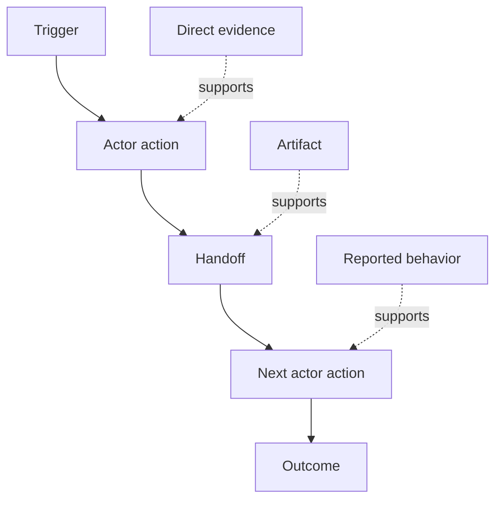

# 发现人们实际执行的工作流

> 需求并不会待在会议里等着被收集。它们散落在动作、变通办法、记录和分歧之中。

**Type:** Learn + Build
**Languages:** Python (stdlib)
**Prerequisites:** Phase 14 · 第 47 课
**Time:** ~70 minutes

## 学习目标

- 把当前工作流建模为带证据的有序动作。
- 把直接观察与转述或推断的行为区分开。
- 定位摩擦、交接、权限和隐藏状态。
- 让不确定的论断保持可见，而不是把它们变成需求。

## 从当前系统开始

不要一上来就问人们想要什么功能。先从重建现在正在发生什么开始。

对每一步，记录：

| 字段 | 示例 |
|---|---|
| 参与者 | 值班工程师 |
| 触发 | 生产告警到达 |
| 动作 | 打开告警，然后搜索仪表盘 |
| 输入 | 告警载荷和部署记录 |
| 输出 | 候选服务和负责人 |
| 摩擦 | 在三个工具之间切换上下文 |
| 权限 | 事故指挥官批准一次写入 |
| 证据 | 屏幕录制、事故日志、runbook |

工作流比屏幕更大。它包括等待、复制粘贴、旁路渠道、审批、错误恢复，以及人们已经不再注意到的那些步骤。

## 证据有强度之分

使用一个简单的证据阶梯：

1. **直接行为：** 观察、跟踪、录制或系统事件。
2. **产物：** 工单、runbook、日志、表单或已完成输出。
3. **转述行为：** 由人描述自己做了什么。
4. **推断：** 团队推断大概发生了什么。

四种都可能有用。只有前两种能直接证明当前行为。给其余的打上标签，以免置信度悄悄膨胀。



## 寻找四样东西

- **摩擦：** 重复的努力、延迟、重新进入或恢复。
- **隐藏状态：** 存在于记忆、聊天或个人笔记中的事实。
- **权限：** 被允许做出有后果的变更的人或系统。
- **异常：** 正常流程不再正常的情况。

AI 功能常常在交接和异常处失败，因为 happy path 是唯一被塑造过的路径。

## 不要用平均抹掉分歧

两个用户可能出于正当理由执行不同的工作流。在你弄清这些差异代表什么之前，先保留这些变体：

- 不同的角色；
- 不同的风险级别；
- 遗留流程和当前流程；
- 专业水平差异；
- 真正的策略分歧。

一个被平均过的工作流可能谁也描述不了。

## Build It

这个实验在每一个工作流步骤上存储证据，校验顺序和置信度，计算直接证据比例，并写出 `outputs/workflow-evidence.json`。

```bash
python3 code/main.py
python3 -m unittest discover code/tests -v
```

添加一条部署记录缺失的异常路径。保持主顺序不变，并记录分支从哪里开始。

## 练习

1. 不做任何访谈，仅凭日志重建一个工作流。
2. 访谈一个用户，并标出每一条仍缺乏直接证据的说法。
3. 加一个权限边界和一个故障恢复步骤。
4. 建模两个工作流变体，而不把它们合并。
5. 找出一个去掉可见步骤、却让隐藏工作原封不动的拟议功能。

## 延伸阅读

- [Nuseibeh 和 Easterbrook，Requirements Engineering: A Roadmap](https://www.cs.toronto.edu/~sme/papers/2000/ICSE2000.pdf)，尤其是它把需求引出当作解释、建模和验证、而非简单采集的论述。
- [Gotel 和 Finkelstein，An Analysis of the Requirements Traceability Problem](https://doi.org/10.1109/ICRE.1994.292398)，用于说明保留需求与其来源之间关系的困难。

## 你保留的成果

保留 `outputs/workflow-evidence.json`。它会在下一课把观察到的摩擦和不确定性转化为假设地图。
