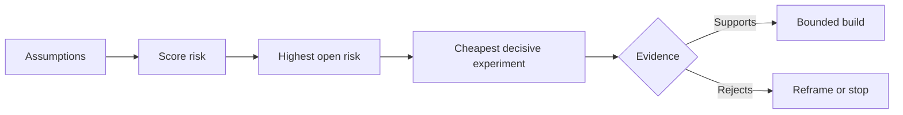

# 绘制假设地图并优先解决风险最大的那个

> 路线图把不确定性藏进了功能里。假设地图则暴露出：在这些功能有资格存在之前，什么必须为真。

**Type:** Learn + Build
**Languages:** Python (stdlib)
**Prerequisites:** Phase 14 · 第 48 课
**Time:** ~65 minutes

## 学习目标

- 把拟议的工作转化为明确的假设。
- 把影响、不确定性和不可逆性分开打分。
- 按风险而非热情来选择下一个实验。
- 用证据和决策替换已检验过的假设。

## 每一次构建都包含赌注

一个事故工具可能依赖于以下这些全部为真：

- 告警上下文包含足够的信息来识别服务；
- 工程师信任一条并非自己推导出来的建议；
- 期望的响应时间在运营上确实重要；
- 所需数据可以在不越权的情况下访问；
- 该工作流发生得足够频繁，足以证明维护是值得的。

这些不是实现任务。它们是让这次构建有价值、可用、可行且安全的前提条件。

## 假设类别

| 类别 | 问题 |
|---|---|
| 价值 | 成果是否足够重要？ |
| 可用性 | 用户能否理解并据以行动？ |
| 可行性 | 系统能否用现有数据和约束产出它？ |
| 存续性 | 组织能否维持成本、归属和运营？ |
| 安全性 | 它能否在失败时不产生不可接受的后果？ |

把假设写成可证伪的陈述。「这个功能很有用」无法检验。「十名值班工程师中有八名借助只读结果更快地识别出正确服务」则可以。

## 风险不是一个数字

这个实验使用三个从一到五的维度：

- **影响：** 假设为假时的损害。
- **不确定性：** 当前证据的薄弱程度。
- **不可逆性：** 承诺之后再学习的代价。

示例分数把影响和不确定性相乘，再加上不可逆性。这个公式并非放之四海而皆准，其目的是迫使团队说明：为什么应当先解决这个未知而不是那个。



## 设计实验，而非确认仪式

一个有用的测试要有：

- 一条可能为假的论断；
- 一个总体或现实的样本；
- 一个可观察的结果；
- 一个在结果出来之前就定好的阈值；
- 针对通过、失败和证据含糊各自的下一步决策。

避免那些只能证明团队有能力把这个想法做出来的测试。

## 可逆性改变顺序

高后果、不可逆的选择需要更早的证据。一次只读回放可以先于生产集成。一个临时适配器可以先于数据迁移。一条经人类批准的建议可以先于自动动作。

构建的形态应当跟随不确定性的形态。

## Build It

这个实验给假设排序，区分已检验与未决的论断，选出风险最高的未决项，并写出 `outputs/assumption-map.json`。

```bash
python3 code/main.py
python3 -m unittest discover code/tests -v
```

改动风险最高那条假设的证据，观察下一个实验如何随之改变。

## 练习

1. 为你想构建的功能写五条假设。
2. 加一条你的功能清单漏掉的安全性假设。
3. 定义一个会让你停止构建的阈值。
4. 把一个大实验替换成一个更便宜的决定性测试。
5. 对比风险排序与路线图优先级，并解释其中的错位。

## 延伸阅读

- [Barry Boehm，A Spiral Model of Software Development and Enhancement](https://dl.acm.org/doi/10.1145/12944.12948)，用于一个由风险驱动的开发循环，在更深的投入之前解决不确定性。
- [Dardenne、van Lamsweerde 和 Fickas，Goal-Directed Requirements Acquisition](https://doi.org/10.1016/0167-6423(93)90021-G)，用于在细化目标的同时暴露障碍和约束。

## 你保留的成果

保留 `outputs/assumption-map.json`。下一课用它来选择能产生决定性证据的最小切片。
