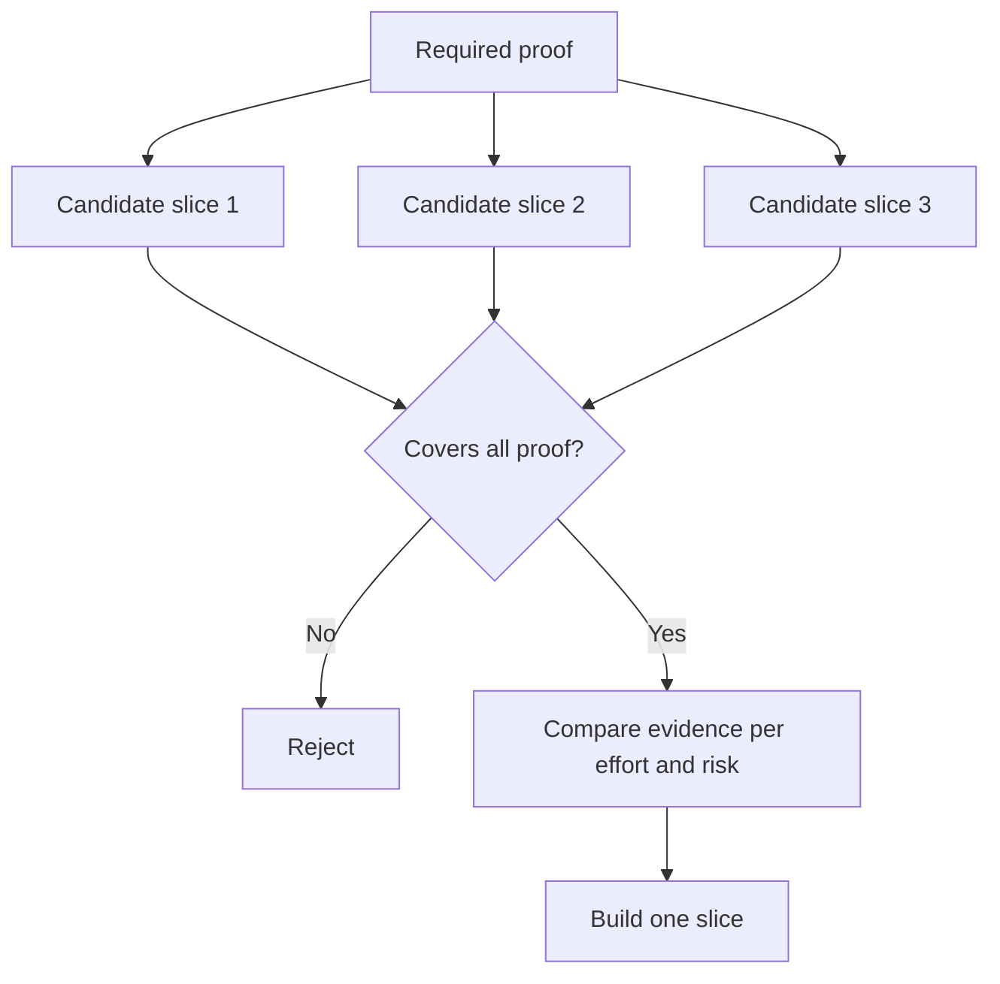

# 选择能改变决策的最小切片

> 小只有在能证明重要之事时才有用。一个无法改变下一步决策的微小构建，只是残缺不全而已。

**Type:** Learn + Build
**Languages:** Python (stdlib)
**Prerequisites:** Phase 14 · 第 49 课
**Time:** ~65 minutes

## 学习目标

- 用切片所证明的假设来定义切片。
- 在成果价值、不确定性降低、投入和后果之间取得平衡。
- 宁可要可逆的证据，也不要过早的生产投入。
- 拒绝那些省略了工作流中高风险部分的切片。

## 纵向意味着端到端的证据

一个有用的切片要横跨为观察成果所需的最小真实工作流。它在用户、数据、时长和能力上可以很窄，但不应该靠删掉你恰恰需要检验的那个不确定性来变窄。

示例：

- 对十起真实事故做一次只读回放，可以检验服务识别和操作者信任。
- 一个跑在合成数据上的精致仪表盘也许能检验理解力，却检验不了数据的可行性。
- 一个生产环境的自动修复器会带着不可接受的后果一次性检验所有东西。

## 先定义必需的证明

取出风险最高的未决假设，把它们转化为一组必需的证明。一个候选切片只有覆盖这组证明才算合格。

然后在以下维度上比较合格的切片：

| 维度 | 方向 |
|---|---|
| 成果价值 | 越高越好 |
| 降低的不确定性 | 越多越好 |
| 投入 | 越少越好 |
| 后果 | 越小越好 |
| 可逆性 | 越高越好 |

这个实验的分数刻意保持简单。资格门槛比算术更重要。



## 常见的伪最小化

- **只有 UI 的最小化：** 去掉了数据和运营上的不确定性。
- **只有基础设施的最小化：** 证明了技术上的可能性，却没有用户价值。
- **happy-path 最小化：** 省略了制造大部分风险的异常。
- **演示最小化：** 产出有说服力的演示品，却没有可重复的度量。
- **平台最小化：** 在某个工作流还没配得上之前就构建可复用的机器。

## 加一条停止规则

在动手实现之前，写下如果切片失败会发生什么：

- 放弃该成果；
- 更换目标用户或情境；
- 检验一种不同的机制；
- 收集更好的证据；
- 进一步收窄权限。

如果每一种结果都导向「继续构建」，那这个切片就不是一个实验。

## Build It

这个实验按必需证明过滤候选，给合格切片打分，并写出 `outputs/slice-decision.json`。

```bash
python3 code/main.py
python3 -m unittest discover code/tests -v
```

添加一个更便宜、但只证明一条必需假设的候选。即使它的数值分数很高，它也应当仍然不合格。

## 练习

1. 为同一成果设计三个处于不同后果级别的切片。
2. 在给它们打分之前先陈述必需的证明集。
3. 在保留决定性证据的同时移除一项能力。
4. 为失败的试点加一条停止规则。
5. 找出一个应当等切片之后再做、可复用的平台组件。

## 延伸阅读

- [Barry Boehm，A Spiral Model of Software Development and Enhancement](https://dl.acm.org/doi/10.1145/12944.12948)，用于让每个开发循环与其必须解决的风险相匹配。
- [Lenarduzzi 和 Taibi，MVP Explained: A Systematic Mapping Study on the Definitions of Minimal Viable Product](https://arxiv.org/abs/1609.07592)，用于说明软件产品实践中围绕「minimum」和「viable」的含糊之处。

## 你保留的成果

保留 `outputs/slice-decision.json`。它记录了这个切片为什么是能改变决策的最小切片。
