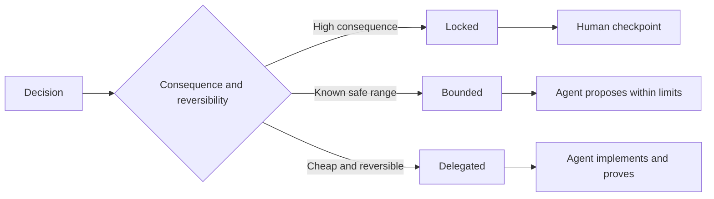

# 写出能保住判断力的规范

> 一份有用的规范固定不变量和证据，同时把可逆的实现选择保持开放。它是一个决策边界，而不是剧本。

**Type:** Learn + Build
**Languages:** Python (stdlib)
**Prerequisites:** Phase 14 · 第 50 课
**Time:** ~75 minutes

## 学习目标

- 把成果、不变量、示例、非目标和证明区分开。
- 把决策标记为锁定、受限或委托。
- 在那些代价低且可逆的选择上保留智能体的判断力。
- 在后果或对外行为发生变化之处要求人类检查点。

## 两个糟糕的极端

规范不足的任务让智能体去猜系统。规范过度的任务让它去照抄一份可能已经错了的设计。

有用的中间地带是一份可执行契约：

| 表面 | 用途 |
|---|---|
| 成果 | 可观察的结果 |
| 不变量 | 必须始终为真的条件 |
| 示例 | 揭示意图的具体用例 |
| 非目标 | 被有意排除的邻近行为 |
| 决策策略 | 哪些选择是锁定、受限或委托的 |
| 证明 | 完成之前所必需的证据 |

## 三种决策模式

- **锁定：** 智能体不得自行选择。用于对外兼容性、权限、安全、不可逆的成本，或一项产品承诺。
- **受限：** 智能体可以在明确的界限内选择。用于搜索预算、重试次数、允许的依赖，或某个已知的接口家族。
- **委托：** 智能体拥有该选择，并必须说明理由。用于局部结构、命名、可逆的重构和实现细节。



## 用示例来规范行为

示例比形容词更能压缩意图。「有帮助」「健壮」「生产就绪」都不是可执行的。一小套涵盖正常、边界、失败和禁止的示例，能同时给构建者和验证者提供具体的东西。

示例不能取代不变量。一个通过的用例证明不了一条普适的安全规则。

## 证明必须与论断相称

- 单元测试证明一个局部函数的契约。
- wire test 证明序列化和传输行为。
- 浏览器旅程证明一条界面路径。
- 回放集证明在代表性用例上的行为。
- 审计日志证明权限边界得到了遵守。

不要把较低层次的证明当作较高层次论断的证据。

## 有意识地保留未知

规范可以写「实现可以在时间预算内返回结果的任意只读源中任选一个」。这不是含糊，而是一条带边界和证明的有意委托决策。

当证据变化时，规范也应当演化。要保留锁定和受限选择背后的理由，让后来的团队不用考古就能修订它们。

## Build It

这个实验校验契约的每一个表面，检查决策模式，并写出 `outputs/executable-specification.json`。

```bash
python3 code/main.py
python3 -m unittest discover code/tests -v
```

把「生产写入」决策从锁定改为委托。解释为什么 schema 接受这个值，而产品风险却不接受。

## 练习

1. 把一张 backlog 工单转化为这六个规范表面。
2. 用一条不变量和两个示例替换三条实现指令。
3. 标记每一条决策，并为每一条锁定或受限的选择说明理由。
4. 为每一条不变量加一份证明回执。
5. 移除一条既无证据也无风险依据的约束。

## 延伸阅读

- [Nuseibeh 和 Easterbrook，Requirements Engineering: A Roadmap](https://www.cs.toronto.edu/~sme/papers/2000/ICSE2000.pdf)，用于说明目标、精确规范、验证、共识和演化之间的关系。
- [Zave 和 Jackson，Four Dark Corners of Requirements Engineering](https://doi.org/10.1145/237432.237434)，用于把环境假设、需求和规范区分开。
- [Gotel 和 Finkelstein，An Analysis of the Requirements Traceability Problem](https://doi.org/10.1109/ICRE.1994.292398)，用于保留一条需求为什么存在、又来自哪里。

## 你保留的成果

保留 `outputs/executable-specification.json`。它成为编码智能体和人类评审者共享的契约。
