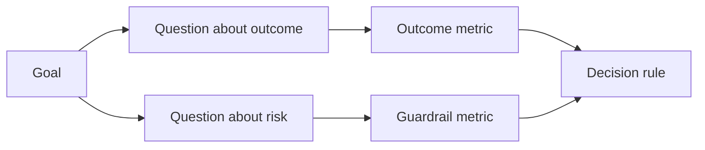

# 在结果出现之前设计成功指标

> 指标应当回答一个决策，而不是装饰一块仪表盘。从目标出发，推导出问题，再选择能回答它们的最小指标集。

**Type:** Learn + Build
**Languages:** Python (stdlib)
**Prerequisites:** Phase 14 · 第 47、51 课
**Time:** ~70 minutes

## 学习目标

- 从成果目标推导出问题和指标。
- 在观察结果之前定义阈值、窗口、来源和方向。
- 把成果指标与护栏和反向指标配对。
- 让评估证据与构建必须支持的决策相匹配。

## 目标、问题、指标

从一个目标出发：

> 在不增加不安全操作的前提下，缩短识别受影响服务的时间。

推导出问题：

- 正确服务被识别出来有多快？
- 识别出的服务有多经常是正确的？
- 诊断是否始终保持只读？
- 该工作流是否会增加告警忽略或操作人员的工作量？

然后选择能够把这些问题落地为可测量项的指标。



## 一个指标需要一份契约

每个指标都需要：

| 字段 | 示例 |
|---|---|
| 名称 | `median_identification_seconds` |
| 方向 | 至多 |
| 阈值 | 120 |
| 窗口 | 十次事故回放 |
| 来源 | 回放事件日志 |
| 人群 | 试点中的值班工程师 |
| 类型 | 成果或护栏 |

没有来源和窗口，一个数字就无法复现。没有阈值，它就无法驱动任何决策。

## 成果、护栏与反向指标

- **成果指标：**期望状态是否改善了？
- **护栏：**一条固定约束是否始终保持为真？
- **反向指标：**局部改善是否把成本或伤害转移到了别处？

对于事故工作流，速度并不够。正确性、生产写入、操作人员工作量和漏掉的告警，都在防止一个快速但不安全的结果。

## 离线与在线证据

离线回放对可复现性和边界覆盖很有用。有边界的试点对真实行为、信任和工作流效应很有用。二者都不能替代对方。

使用能够回答当前决策的最廉价证据。不要仅仅因为实现已经就绪，就把真实用户暴露出来。

## 在测量之前先做决定

在看到结果之前，先写下通过、失败和模糊三种路径。否则团队会把阈值挪动到保护构建的位置。

例如：

- 通过：正确服务率至少 0.9，且中位时间至多 120 秒；
- 失败：出现任何生产写入，或正确率低于 0.75；
- 模糊：改善幅度小且方差大，需要更大的回放集。

## Build It

这个实验校验一份测量计划，评估包含性阈值，记录缺失值，并写出 `outputs/measurement-report.json`。

```bash
python3 code/main.py
python3 -m unittest discover code/tests -v
```

移除护栏指标，观察为什么即使成果指标还在，计划也会变得无效。

## 练习

1. 从一个成果目标推导出三个问题。
2. 添加一个能捕获成本被转移到另一个角色的反向指标。
3. 为每个指标定义来源、人群和窗口。
4. 在生成数值之前，先写出通过、失败和模糊的决定。
5. 找出一个容易采集但无法改变决策的指标，把它移除。

## 延伸阅读

- [Basili，Software Modeling and Measurement: The Goal/Question/Metric Paradigm](https://drum.lib.umd.edu/items/8119803a-362b-42ec-b6ce-2311713e7236)，用于从明确的目标推导出可操作的测量。
- [Basili、Caldiera 和 Rombach，The Goal Question Metric Approach](https://www.cs.toronto.edu/~sme/CSC444F/handouts/GQM-paper.pdf)，用于把该方法作为一个反馈和改进系统来应用。

## 你保留的成果

保留 `outputs/measurement-report.json`。它为原型、试点或生产阶段定义了证据门槛。