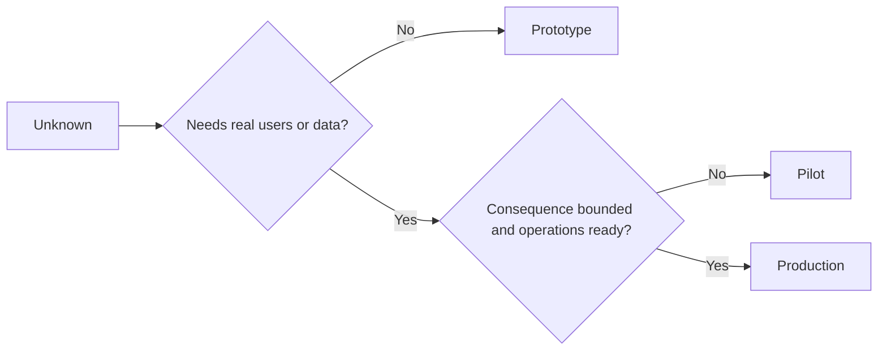

# 审慎选择原型、试点或生产

> 这是三种不同的学习环境，而不是打磨程度的高低。选择那个能用最少的不必要后果回答当前未知的阶段。

**Type:** Learn + Build
**Languages:** Python (stdlib)
**Prerequisites:** Phase 14 · 第 50–52 课
**Time:** ~70 minutes

## 学习目标

- 从未知、受众、数据、后果和就绪程度出发选择构建阶段。
- 定义各阶段特有的控制和退出标准。
- 防止原型悄悄变成生产系统。
- 把真实权限推迟到证据和运维都足以支持它的时候。

## 三个不同的问题

| 阶段 | 首要问题 |
|---|---|
| 原型 | 这个机制到底能否产出证据？ |
| 试点 | 它能否在有边界的真实受众和真实条件下安全地工作？ |
| 生产 | 我们能否以承诺的可靠性和风险水平持续地拥有它？ |

一个原型可以在技术上完全可用却仍然是一次性的。一个试点可以既使用生产数据，又在受众和权限上保持受限。当组织接受持续的责任时，才算进入生产。

## 原型

当未知不需要真实用户或真实数据时，使用原型。让它保持：

- 可丢弃；
- 隔离；
- 行为范围窄；
- 对学习问题本身明确；
- 不带有虚假的运维保证。

在机制赢得进入下一个阶段之前，不要优化架构。

## 试点

当未知需要真实行为、真实数据或真实工作流，但后果或就绪程度尚不支持广泛发布时，使用试点。

一个试点需要：

- 一个明确命名的受众；
- 一位人类负责人；
- 有边界的时长和权限；
- 审计和回滚；
- 成果和护栏阈值；
- 用于扩展、修订或停止的退出标准。

## 生产

生产需要的不仅仅是部署：

- 服务水平目标；
- 值班和事故归属；
- 安全和隐私审查；
- 成本和容量控制；
- 回滚和恢复；
- 持续监控；
- 一条退役路径。



## 阶段漂移

当原型代码获得用户、数据或权限却没有获得归属时，它就开始变得危险。要在配置、访问控制、遥测和文档中标注原型和试点的边界。一条警告横幅是不够的。

阶段应当能够从系统本身被观察到。

## Build It

这个实验从决策上下文选择阶段，返回所需的控制，并写出 `outputs/stage-decisions.json`。

```bash
python3 code/main.py
python3 -m unittest discover code/tests -v
```

把试点示例改为低后果且具备运维就绪程度。解释还需要哪些额外证据才能证明进入生产是合理的。

## 练习

1. 按学习阶段而非部署状态给三个当前项目分类。
2. 写出包含停止决定的试点退出标准。
3. 添加一项能阻止原型接触到生产数据的技术控制。
4. 找出第一项让构建进入生产的运维责任。
5. 为有边界的试点设计一份回滚回执。

## 延伸阅读

- [Barry Boehm，A Spiral Model of Software Development and Enhancement](https://dl.acm.org/doi/10.1145/12944.12948)，用于让每一轮迭代的投入与已解决的风险相匹配。
- [Fagerholm 等人，Building Blocks for Continuous Experimentation](https://doi.org/10.1145/2601248.2601276)，用于持续运行实验所需的组织和技术条件。

## 你保留的成果

保留 `outputs/stage-decisions.json`。它记录每个阶段为何成立，以及在进入下一阶段之前必须存在哪些控制。