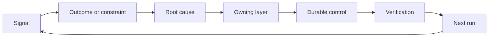

# 用归属和退役构建反馈棘轮

> 交付关上一个构建循环，又打开一个学习循环。证据必须改变系统，否则它就变成没人认领的遥测。

**Type:** Learn + Build
**Languages:** Python (stdlib)
**Prerequisites:** Phase 14 · 第 46、53 课
**Time:** ~75 minutes

## 学习目标

- 把事故、评估、用户行为和纠正转化为有归属的行动。
- 把每个信号路由到上下文、评估、策略、运行时或积压。
- 按严重程度和频率对复发排序。
- 给每项控制一个退役条件。

## 反馈是基础设施

一个团队可以采集追踪、评估、工单和事故日志，却从中什么也没学到。缺失的机制是晋升：一条从观察到持久变化、并带有负责人和证明的明确路径。

这个循环是：

1. 观察到一个具体的信号；
2. 把它与一个成果、约束或假设联系起来；
3. 找出最早拥有该原因的系统层；
4. 创建一个有边界的改变；
5. 验证复发变得不太可能；
6. 审查该项控制是否应该保留。

## 路由到归属层

| 信号 | 去向 |
|---|---|
| 误报、回归、错误结果 | 评估或测试 |
| 缺失上下文、重复工作、过时事实 | 上下文来源或检索路由 |
| 不安全操作或权限缺口 | 策略或权限边界 |
| 超时、重试风暴、依赖不可用 | 运行时控制 |
| 新的产品需求或未决的取舍 | 已塑形积压项 |

在最早有效的层修复原因。当一条测试或一项权限就能让失败无从发生时，不要再添加一段提示词。



## 归属是控制的一部分

每个棘轮动作都需要：

- 一位负责人；
- 基于后果和复发的优先级；
- 要改变的产物；
- 证明该改变的验证；
- 一个审查或过期窗口；
- 一个退役条件。

一个没有归属的改进，不过是一条排版更好的观察记录。

## 退役过时的控制

反馈系统会累积策略。这些策略会变得自相矛盾且代价高昂。在以下情况审查控制：

- 架构或工作流发生变化；
- 一个更低层的不变量取代了一条更高层的指令；
- 在所选窗口内，被保护的失败没有出现过；
- 该项控制阻碍正当工作的次数，超过它防止伤害的次数。

退役同样需要证据。不要因为一项控制「感觉过时」就删除它。

## 连接构建反馈与编码智能体反馈

同一个棘轮服务于两条路径：

- 产品证据改变成果框架、假设、切片或测量计划。
- 编码智能体的纠正改变测试、上下文、范围、自动化或交接。
- 事故可以同时改变产品边界和智能体工作台。

这就是为什么「塑造构建」不是一个在编码之前就结束的阶段。它会贯穿每一个被接受的变更。

## Build It

这个实验对信号分类，创建有归属的棘轮动作，为它们排序，并写出 `outputs/feedback-backlog.json`。

```bash
python3 code/main.py
python3 -m unittest discover code/tests -v
```

添加一个运行时超时信号，并确认它被路由到运行时而不是普通积压。

## 练习

1. 把一起事故和一条用户投诉转化为棘轮动作。
2. 说出能够预防每一次复发的最早一层。
3. 给实验输出添加验证命令或观察。
4. 为一条策略规则定义一个退役条件。
5. 把一个已被接受的纠正追溯到下一个任务框架中。

## 延伸阅读

- [Basili、Caldiera 和 Rombach，The Goal Question Metric Approach](https://www.cs.toronto.edu/~sme/CSC444F/handouts/GQM-paper.pdf)，用于通过目标导向的测量实现组织学习。
- [Fagerholm 等人，Building Blocks for Continuous Experimentation](https://doi.org/10.1145/2601248.2601276)，用于把证据和持续产品开发连接起来的技术与组织循环。
- [Nuseibeh 和 Easterbrook，Requirements Engineering: A Roadmap](https://www.cs.toronto.edu/~sme/papers/2000/ICSE2000.pdf)，用于把需求视为贯穿系统生命周期持续演化的东西。

## 你保留的成果

保留 `outputs/feedback-backlog.json`。它是「Product Judgment and Delivery」路径的收尾产物，也是下一个成果框架的输入。